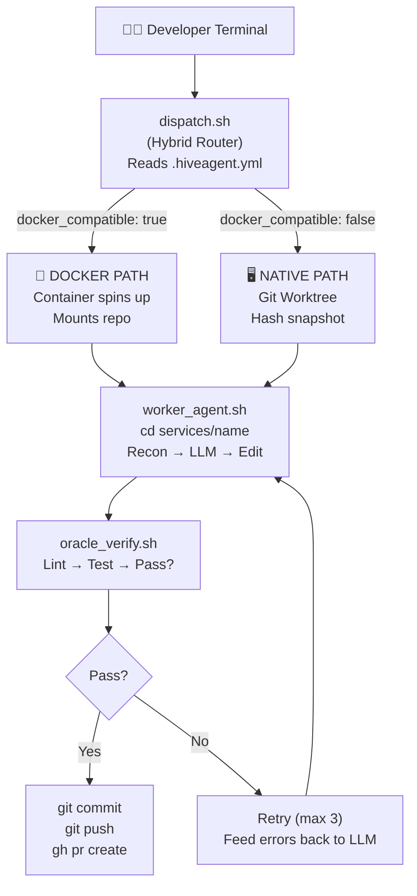
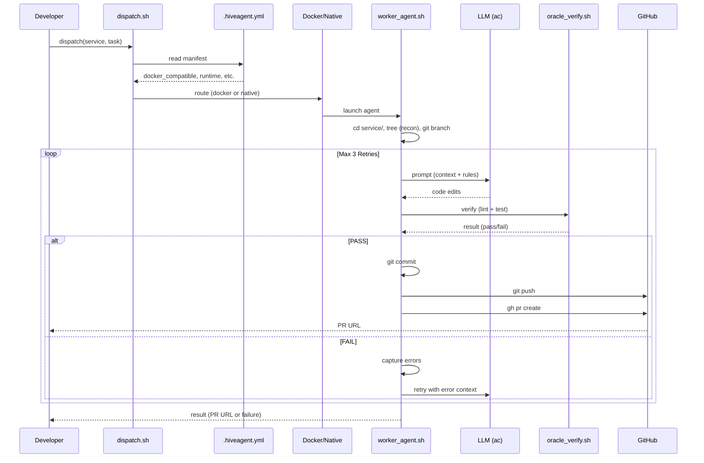
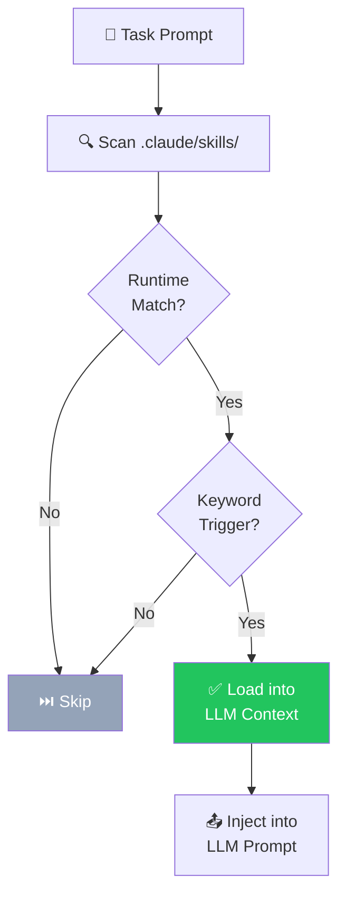

# HiveAgent v5.0 — Hybrid Agentic Intelligence Development Workflow

## Complete Implementation Guide

> [!NOTE]
> **Version:** 5.0 | **Date:** February 2026
> **Objective:** Eliminate AI hallucinations by locking agents into isolated service contexts, forcing them to read existing code, pass verification, and submit clean Pull Requests — supporting both Docker and non-Docker enterprise environments.

---

## Table of Contents

1. [Executive Summary](#1-executive-summary)
2. [System Architecture](#2-system-architecture)
3. [Execution Flow](#3-execution-flow)
4. [Directory Structure](#4-directory-structure)
5. [Service Manifest Specification](#5-service-manifest-specification)
6. [Component Implementation](#6-component-implementation)
7. [Claude Skills](#7-claude-skills) ← **NEW**
8. [Quality Gate Pipeline](#8-quality-gate-pipeline)
9. [Security & Guardrails](#9-security--guardrails)
10. [Operational Runbook](#10-operational-runbook)
11. [Failure Modes & Recovery](#11-failure-modes--recovery)
12. [Extension Points](#12-extension-points)

---

## 1. Executive Summary

### The Problem

AI coding agents hallucinate when given broad repository access. They:
- Invent file paths that don't exist
- Rewrite entire files instead of applying surgical patches
- Break other services by modifying shared infrastructure
- Skip testing and produce code that doesn't compile

### The Solution

HiveAgent enforces a **Command & Control** model with four pillars:

| Pillar | Mechanism | Effect |
|--------|-----------|--------|
| **Context Isolation** | Agent is locked into a single `services/<name>/` directory | Cannot see or modify other services |
| **Brownfield-First** | Agent must READ code before editing | Prevents full-file rewrites and hallucinated APIs |
| **Mandatory Verification** | Oracle test runner gates all output | Code must pass lint + tests before any PR |
| **Blast Radius Enforcement** | Pre-commit hooks + hash checks | Any unauthorized file modification is detected and rolled back |

### Hybrid Capability

The framework supports **mixed enterprise environments** where some services are Docker-compatible and others are not (due to licensed runtimes, hardware dependencies, on-prem requirements, etc.).

| Mode | Isolation Method | When Used |
|------|-----------------|-----------|
| **Docker** | Container filesystem + volume mounts | Service has `docker_compatible: true` in manifest |
| **Native** | Git worktree + filesystem hash checks + pre-commit hooks | Service has `docker_compatible: false` in manifest |

---

## 2. System Architecture

### 2.1 High-Level Architecture



### 2.2 Component Interaction Map

```
dispatch.sh ──reads──▶ .hiveagent.yml (per-service manifest)
     │
     ├──[docker=true]──▶ docker-compose run ──▶ worker_agent.sh (in container)
     │
     └──[docker=false]─▶ dispatch_native.sh
                              │
                              ├── git worktree add /tmp/hiveagent-<id>
                              ├── snapshot filesystem hash
                              ├── worker_agent.sh (native)
                              └── verify blast radius (post-run hash check)

worker_agent.sh:
     ├── cd services/$TARGET_SERVICE
     ├── tree -L 2 (recon)
     ├── git checkout -b ai/<timestamp>-<service>
     └── LOOP (max 3):
           ├── call LLM with context + rules
           ├── oracle_verify.sh
           │     ├── read .hiveagent.yml for lint_command / test_command
           │     └── fallback: auto-detect language
           ├── [PASS] → git commit → git push → gh pr create → EXIT 0
           └── [FAIL] → capture error log → feed to LLM → RETRY
```

---

## 3. Execution Flow

### 3.1 Complete Sequence Diagram



### 3.2 Decision Flow — Hybrid Routing

```mermaid
flowchart TD
    START(["START"]) --> VALIDATE{"Service\nexists?"}
    VALIDATE --> |NOT FOUND| EXIT1["❌ EXIT 1 (error)"]
    VALIDATE --> |EXISTS| MANIFEST{"`.hiveagent.yml`\nexists?"}
    MANIFEST --> |NOT FOUND| DEFAULT["Default to NATIVE mode"]
    MANIFEST --> |EXISTS| READ["Read manifest:\ndocker_compatible"]
    READ --> |true| DOCKER["🐳 DOCKER PATH\nCompose run\nwith env vars"]
    READ --> |false| NATIVE2["🖥️ NATIVE PATH\nCheck prereqs\nGit worktree\nHash snapshot"]
    DEFAULT --> NATIVE2
    DOCKER --> WORKER["worker_agent.sh\n(same in both)"]
    NATIVE2 --> WORKER
    WORKER --> LOOP["Execution Loop\n(max 3 retries)"]
    LOOP --> ORACLE{"Oracle\nPass?"}
    ORACLE --> |Yes| COMMIT["✅ Commit → Push → PR"]
    ORACLE --> |"No (retries left)"| FEED["Feed errors → Retry"]
    FEED --> LOOP
```

---

## 4. Directory Structure

```
root/
├── .claude/                        # [THE BRAIN] AI behavior rules
│   ├── rules.md                    # Persona + strict isolation protocols
│   └── skills/                     # [SKILLS] Reusable agent capabilities
│       ├── brownfield-edit.md      # Read-before-write protocol
│       ├── surgical-patch.md       # Minimal change discipline
│       ├── test-driven-fix.md      # Fix code + update tests
│       ├── oracle-retry.md         # Error analysis + retry strategy
│       └── service-onboarding.md   # Adding a new service to HiveAgent
│
├── .env                            # Secrets (ANTHROPIC_API_KEY, GITHUB_TOKEN)
├── .gitignore                      # Ignore .env, node_modules, venv, etc.
│
├── services/                       # [THE TARGETS] Each subdirectory = one microservice
│   ├── booking-service/             # Example: Node.js + Express
│   │   ├── .hiveagent.yml               # ◀── Service manifest (Docker mode)
│   │   ├── src/
│   │   ├── tests/
│   │   ├── package.json
│   │   └── Dockerfile              # Service-specific Dockerfile
│   │
│   ├── learning-service/            # Example: Python + FastAPI
│   │   ├── .hiveagent.yml               # ◀── Service manifest (Docker mode)
│   │   ├── app/
│   │   ├── tests/
│   │   ├── requirements.txt
│   │   └── pyproject.toml
│   │
│   ├── config-service/              # Example: .NET + Oracle dependency
│   │   ├── .hiveagent.yml               # ◀── Service manifest (Native mode)
│   │   ├── src/
│   │   ├── tests/
│   │   └── ConfigService.sln
│   │
│   └── notification-engine/         # Example: Java + Gradle
│       ├── .hiveagent.yml               # ◀── Service manifest (Native mode)
│       ├── src/
│       ├── tests/
│       └── build.gradle
│
├── scripts/                        # [THE TOOLING] All orchestration scripts
│   ├── dispatch.sh                 # Hybrid router (entry point)
│   ├── dispatch_native.sh          # Native-mode launcher (git worktree)
│   ├── worker_agent.sh             # Agent execution loop
│   ├── oracle_verify.sh            # Polyglot test runner
│   ├── quality_gate_pipeline.sh    # Quality gate orchestrator (Section 7)
│   ├── gates/                      # Individual quality gate scripts
│   │   ├── static_analysis.sh      #   Gate 1: Semgrep, CodeQL, ESLint
│   │   ├── security_scan.sh        #   Gate 2: Trivy, Snyk, Bandit
│   │   ├── dependency_audit.sh     #   Gate 3: npm audit, pip-audit
│   │   ├── coverage_check.sh       #   Gate 4: nyc, coverage.py, go cover
│   │   ├── ai_code_review.sh       #   Gate 5: LLM-powered code review
│   │   └── license_check.sh        #   Gate 6: License compliance
│   ├── fleet_status.sh             # Dashboard: lists all services + modes
│   ├── cleanup.sh                  # Remove stale worktrees + branches
│   └── ac                          # LLM API wrapper (your agent CLI)
│
├── docker/                         # [DOCKER ASSETS] Per-runtime images
│   ├── Dockerfile.node             # Node.js agent image
│   ├── Dockerfile.python           # Python agent image
│   ├── Dockerfile.go               # Go agent image
│   └── Dockerfile.universal        # Kitchen-sink fallback
│
├── docker-compose.yml              # Compose config for Docker-mode services
│
├── logs/                           # [AUDIT TRAIL] Mission logs
│   └── 2026-02-10-learning-service.json
│
└── .git/
    └── hooks/
        └── pre-commit              # ◀── Blast radius enforcer hook
```

---

## 5. Service Manifest Specification (`.hiveagent.yml`)

Every service **must** contain a `.hiveagent.yml` file. This is the **single source of truth** for how the HiveAgent framework interacts with that service.

### 5.1 Full Schema

```yaml
# .hiveagent.yml — Service Manifest
# Required fields are marked with [REQUIRED]

# [REQUIRED] Human-readable service name
name: learning-service

# [REQUIRED] Primary runtime / framework
# Common values: node | react | angular | python | go | java | dotnet-core | dotnet-framework | csharp | rust | ruby | php
# This is NOT limited to the above — use any identifier that matches your stack.
# The Oracle will auto-detect the build system if unrecognized.
runtime: python

# [REQUIRED] Can this service run inside a Docker container?
docker_compatible: true

# [OPTIONAL] Custom Docker image. If omitted, uses the default image
#            for the detected runtime from docker/Dockerfile.<runtime>
docker_image: python:3.11-slim

# [REQUIRED] Command to run unit/integration tests
test_command: pytest -v

# [OPTIONAL] Command to run linting/static analysis. If omitted, skipped.
lint_command: flake8 . --select=E9,F63,F7,F82

# [OPTIONAL] Command to run type checking. If omitted, skipped.
type_check_command: mypy app/

# [OPTIONAL] Command to install dependencies before testing
setup_command: pip install -r requirements.txt

# [OPTIONAL] Reason why Docker is not compatible (for documentation)
reason: ""

# [OPTIONAL] Prerequisites for native execution
# Displayed to the developer before launching native mode
prerequisites:
  - "Python 3.11+ must be installed"
  - "Virtual environment must be activated"

# [OPTIONAL] Readable paths outside this service directory
# Agent gets READ-ONLY access to these paths for shared types, contracts, etc.
readable_paths:
  - shared/contracts/
  - shared/proto/

# [OPTIONAL] Maximum retries for the execution loop. Default: 3
max_retries: 3

# [OPTIONAL] Maximum cost in USD for LLM calls. Default: 5.00
max_cost_usd: 5.00

# [OPTIONAL] Token budget for LLM context. Default: 50000
token_budget: 50000

# ── QUALITY GATES (Section 7) ──────────────────────────────────
# All gates are optional. Omit any gate block to skip it entirely.
quality_gates:
  static_analysis:
    enabled: true
    tool: semgrep            # semgrep | sonarqube | codeql | auto
    config: .semgrep.yml     # tool-specific config file
    severity_threshold: warning

  security_scan:
    enabled: true
    tool: trivy              # trivy | snyk | bandit | grype
    severity_threshold: HIGH
    ignore_unfixed: true

  dependency_audit:
    enabled: true
    fail_on_severity: high   # critical | high | moderate | low

  coverage:
    enabled: true
    minimum_percentage: 80
    diff_coverage_minimum: 90

  code_review:
    enabled: true
    review_scope: diff_only  # diff_only | full_file | full_service
    complexity_threshold: 15
    max_function_lines: 50

  license_check:
    enabled: false           # opt-in (requires license tooling)
    blocked_licenses:
      - GPL-3.0
      - AGPL-3.0
```

### 5.2 Minimal Example (Docker Service)

```yaml
name: booking-service
runtime: node
docker_compatible: true
test_command: npm test
lint_command: npm run lint
```

### 5.3 Minimal Example (.NET Framework — Native Mode)

```yaml
name: config-service
runtime: dotnet-framework
docker_compatible: false
reason: ".NET Framework 4.x requires Windows host with MSBuild"
test_command: dotnet test
lint_command: dotnet build /p:TreatWarningsAsErrors=true
prerequisites:
  - "MSBuild 17.x or Visual Studio Build Tools installed"
  - "Oracle client 19c must be installed"
  - "VPN must be connected for license server"
```

### 5.4 Minimal Example (React.js)

```yaml
name: student-portal
runtime: react
docker_compatible: true
test_command: "CI=true npm test"
lint_command: npm run lint
setup_command: npm install
```

### 5.5 Minimal Example (Angular)

```yaml
name: instructor-dashboard
runtime: angular
docker_compatible: true
test_command: "npx ng test --watch=false --browsers=ChromeHeadless"
lint_command: npx ng lint
setup_command: npm install
```

### 5.6 Minimal Example (.NET Core / C#)

```yaml
name: enrollment-service
runtime: dotnet-core
docker_compatible: true
test_command: dotnet test
lint_command: dotnet build /p:TreatWarningsAsErrors=true
setup_command: dotnet restore
```

---

## 6. Component Implementation

### 6.1 The Hybrid Dispatcher (`scripts/dispatch.sh`)

**Role:** The single entry point. Validates the target, reads the manifest, and routes to the correct execution path.

```bash
#!/bin/bash
set -euo pipefail

# ═══════════════════════════════════════════════════════════════
# HiveAgent v5.0 — Hybrid Dispatcher
# USAGE: ./scripts/dispatch.sh <SERVICE_NAME> "<TASK_PROMPT>"
# ═══════════════════════════════════════════════════════════════

SERVICE_NAME="${1:?❌ Usage: dispatch.sh <SERVICE_NAME> <TASK_PROMPT>}"
TASK_PROMPT="${2:?❌ Usage: dispatch.sh <SERVICE_NAME> <TASK_PROMPT>}"
MANIFEST="services/$SERVICE_NAME/.hiveagent.yml"
LOG_DIR="logs"
TIMESTAMP=$(date +%Y-%m-%dT%H:%M:%S)
LOG_FILE="$LOG_DIR/${TIMESTAMP}-${SERVICE_NAME}.json"
LOCK_FILE="services/$SERVICE_NAME/.hiveagent.lock"

# ── 0. Check Prerequisites (yq required) ──────────────────────
if ! command -v yq &>/dev/null; then
    echo "❌ ERROR: 'yq' is required but not installed."
    echo "   Install: https://github.com/mikefarah/yq#install"
    echo "   brew install yq  |  snap install yq  |  go install github.com/mikefarah/yq/v4@latest"
    exit 1
fi

# ── 1. Validate Target ─────────────────────────────────────────
if [ ! -d "services/$SERVICE_NAME" ]; then
    echo "❌ ERROR: Service '$SERVICE_NAME' not found in services/ directory."
    echo ""
    echo "Available targets:"
    for dir in services/*/; do
        [ -d "$dir" ] && echo "  → $(basename "$dir")"
    done
    exit 1
fi

# ── 1.5 Acquire Per-Service Lock ───────────────────────────────
# Prevents concurrent agents from dispatching to the same service
exec 200>"$LOCK_FILE"
if ! flock -n 200; then
    echo "🔒 ERROR: Service '$SERVICE_NAME' is already being processed by another agent."
    echo "   Lock file: $LOCK_FILE"
    echo "   If this is stale, remove it: rm $LOCK_FILE"
    exit 1
fi
echo "🔓 Lock acquired for $SERVICE_NAME"

# Ensure lock is released on exit
release_lock() {
    flock -u 200 2>/dev/null || true
    rm -f "$LOCK_FILE" 2>/dev/null || true
}
trap release_lock EXIT

# ── 2. Read Service Manifest (via yq) ──────────────────────────
if [ -f "$MANIFEST" ]; then
    DOCKER_COMPATIBLE=$(yq '.docker_compatible // false' "$MANIFEST")
    RUNTIME=$(yq '.runtime // "unknown"' "$MANIFEST")
    MAX_RETRIES=$(yq '.max_retries // 3' "$MANIFEST")
    MAX_COST=$(yq '.max_cost_usd // 5.00' "$MANIFEST")
    SETUP_CMD=$(yq '.setup_command // ""' "$MANIFEST")
    TOKEN_BUDGET=$(yq '.token_budget // 50000' "$MANIFEST")
else
    echo "⚠️  No .hiveagent.yml found for '$SERVICE_NAME'. Defaulting to native mode."
    DOCKER_COMPATIBLE="false"
    RUNTIME="unknown"
    MAX_RETRIES=3
    MAX_COST="5.00"
    SETUP_CMD=""
    TOKEN_BUDGET=50000
fi

# ── 3. Initialize Audit Log ────────────────────────────────────
mkdir -p "$LOG_DIR"
cat > "$LOG_FILE" <<EOF
{
  "timestamp": "$TIMESTAMP",
  "service": "$SERVICE_NAME",
  "task": "$TASK_PROMPT",
  "runtime": "$RUNTIME",
  "mode": "$([ "$DOCKER_COMPATIBLE" == "true" ] && echo "docker" || echo "native")",
  "max_retries": $MAX_RETRIES,
  "max_cost_usd": $MAX_COST,
  "result": "in_progress",
  "attempts": 0,
  "pr_url": null,
  "error": null
}
EOF

# ── 4. Display Mission Brief ───────────────────────────────────
echo "╔══════════════════════════════════════════════════════╗"
echo "║           HiveAgent v5.0 — MISSION BRIEF                 ║"
echo "╠══════════════════════════════════════════════════════╣"
echo "║  🎯 Target:   $SERVICE_NAME"
echo "║  📝 Mission:  $TASK_PROMPT"
echo "║  ⚙️  Runtime:  $RUNTIME"
echo "║  🔄 Retries:  $MAX_RETRIES"
echo "║  💰 Budget:   \$$MAX_COST"
echo "║  🚀 Mode:     $([ "$DOCKER_COMPATIBLE" == "true" ] && echo "🐳 Docker" || echo "🖥️  Native")"
echo "╚══════════════════════════════════════════════════════╝"
echo ""

# ── 5. Route: Docker or Native ─────────────────────────────────
export TARGET_SERVICE="$SERVICE_NAME"
export TASK_PROMPT="$TASK_PROMPT"
export MAX_RETRIES="$MAX_RETRIES"
export MAX_COST_USD="$MAX_COST"
export TOKEN_BUDGET="$TOKEN_BUDGET"
export LOG_FILE="$LOG_FILE"
export SETUP_CMD="$SETUP_CMD"
export RUNTIME="$RUNTIME"

if [ "$DOCKER_COMPATIBLE" == "true" ]; then
    echo "🐳 Launching Docker-isolated execution..."
    echo ""
    
    CUSTOM_IMAGE=$(yq '.docker_image // ""' "$MANIFEST" 2>/dev/null)
    
    docker-compose run --rm \
      -e TARGET_SERVICE="$SERVICE_NAME" \
      -e TASK_PROMPT="$TASK_PROMPT" \
      -e MAX_RETRIES="$MAX_RETRIES" \
      -e MAX_COST_USD="$MAX_COST" \
      -e SETUP_CMD="$SETUP_CMD" \
      ${CUSTOM_IMAGE:+-e DOCKER_IMAGE="$CUSTOM_IMAGE"} \
      -v "$HOME/.ssh:/root/.ssh:ro" \
      -v "$HOME/.gitconfig:/root/.gitconfig:ro" \
      hiveagent-worker
    EXIT_CODE=$?
else
    echo "🖥️  Launching native execution with worktree isolation..."
    echo ""
    
    # Check prerequisites
    if yq '.prerequisites' "$MANIFEST" 2>/dev/null | grep -q '\S'; then
        echo "⚠️  Prerequisites for $SERVICE_NAME:"
        yq '.prerequisites[]' "$MANIFEST" 2>/dev/null | sed 's/^/   → /'
        echo ""
        read -p "Are all prerequisites met? (y/n): " CONFIRM
        if [ "$CONFIRM" != "y" ]; then
            echo "Aborted by user."
            # Update audit log
            sed -i 's/"result": "in_progress"/"result": "aborted"/' "$LOG_FILE"
            exit 1
        fi
    fi
    
    ./scripts/dispatch_native.sh "$SERVICE_NAME" "$TASK_PROMPT"
    EXIT_CODE=$?
fi

# ── 6. Final Status ────────────────────────────────────────────
if [ $EXIT_CODE -eq 0 ]; then
    echo ""
    echo "════════════════════════════════════════════════"
    echo "✅ MISSION COMPLETE — PR submitted for review"
    echo "════════════════════════════════════════════════"
else
    echo ""
    echo "════════════════════════════════════════════════"
    echo "❌ MISSION FAILED — See $LOG_FILE for details"
    echo "════════════════════════════════════════════════"
fi

exit $EXIT_CODE
```

---

### 6.2 Native Dispatch (`scripts/dispatch_native.sh`)

**Role:** Creates an isolated git worktree and enforces blast radius checks for non-Docker services.

```bash
#!/bin/bash
set -euo pipefail

# ═══════════════════════════════════════════════════════════════
# HiveAgent v5.0 — Native Dispatch (Git Worktree Isolation)
# Called by dispatch.sh when docker_compatible=false
# ═══════════════════════════════════════════════════════════════

SERVICE_NAME="$1"
TASK_PROMPT="$2"
WORKTREE_ID="HiveAgent-$(date +%s)-$SERVICE_NAME"
WORKTREE_DIR="/tmp/$WORKTREE_ID"
BRANCH_NAME="ai/$(date +%s)-$SERVICE_NAME"
ORIGINAL_DIR="$(pwd)"

cleanup() {
    echo "🧹 Cleaning up worktree..."
    cd "$ORIGINAL_DIR"
    git worktree remove "$WORKTREE_DIR" --force 2>/dev/null || true
    # Only delete branch if mission failed
    if [ "${MISSION_SUCCESS:-false}" != "true" ]; then
        git branch -D "$BRANCH_NAME" 2>/dev/null || true
    fi
}
trap cleanup EXIT

# ── 1. Create Isolated Worktree ────────────────────────────────
echo "📂 Creating isolated worktree at $WORKTREE_DIR..."
git worktree add "$WORKTREE_DIR" -b "$BRANCH_NAME"
cd "$WORKTREE_DIR"

# ── 2. Snapshot: Hash all files OUTSIDE the target service ─────
echo "📸 Taking blast radius snapshot..."
BEFORE_HASH=$(find services/ -not -path "services/$SERVICE_NAME/*" \
    -not -path "services/$SERVICE_NAME" \
    -type f -exec md5sum {} \; 2>/dev/null | sort | md5sum)

# ── 3. Enforce readable_paths as Read-Only ─────────────────────
# Prevent the agent from writing to shared paths declared in manifest
MANIFEST="services/$SERVICE_NAME/.hiveagent.yml"
if [ -f "$MANIFEST" ] && yq '.readable_paths' "$MANIFEST" 2>/dev/null | grep -q '\S'; then
    echo "🔒 Enforcing read-only access on shared paths..."
    yq '.readable_paths[]' "$MANIFEST" 2>/dev/null | while read rpath; do
        if [ -d "$rpath" ]; then
            chmod -R a-w "$rpath" 2>/dev/null || true
            echo "   🔒 Read-only: $rpath"
        fi
    done
fi

# ── 4. Run Worker Agent ────────────────────────────────────────
export TARGET_SERVICE="$SERVICE_NAME"
export TASK_PROMPT="$TASK_PROMPT"
export WORKSPACE_ROOT="$WORKTREE_DIR"
export EXECUTION_MODE="native"

timeout 1800 ./scripts/worker_agent.sh  # 30-minute overall mission timeout
WORKER_EXIT=$?
if [ $WORKER_EXIT -eq 124 ]; then
    echo "⏰ MISSION TIMED OUT after 30 minutes"
fi

# ── 5. Restore write permissions on shared paths ───────────────
if [ -f "$MANIFEST" ] && yq '.readable_paths' "$MANIFEST" 2>/dev/null | grep -q '\S'; then
    yq '.readable_paths[]' "$MANIFEST" 2>/dev/null | while read rpath; do
        [ -d "$rpath" ] && chmod -R u+w "$rpath" 2>/dev/null || true
    done
fi

# ── 6. Blast Radius Verification ───────────────────────────────
echo ""
echo "🔍 Verifying blast radius..."
AFTER_HASH=$(find services/ -not -path "services/$SERVICE_NAME/*" \
    -not -path "services/$SERVICE_NAME" \
    -type f -exec md5sum {} \; 2>/dev/null | sort | md5sum)

if [ "$BEFORE_HASH" != "$AFTER_HASH" ]; then
    echo "🚨 ═══════════════════════════════════════════════════"
    echo "🚨 BLAST RADIUS BREACH DETECTED!"
    echo "🚨 Files outside services/$SERVICE_NAME were modified."
    echo "🚨 ═══════════════════════════════════════════════════"
    echo ""
    echo "Modified files outside target:"
    git diff --name-only | grep -v "^services/$SERVICE_NAME/" || true
    echo ""
    echo "All changes have been discarded. Worktree will be destroyed."
    
    # Update audit log
    if [ -n "${LOG_FILE:-}" ]; then
        sed -i 's/"result": "in_progress"/"result": "blast_radius_breach"/' "$LOG_FILE"
    fi
    exit 1
fi

echo "✅ Blast radius verified: Only services/$SERVICE_NAME was touched."

if [ $WORKER_EXIT -eq 0 ]; then
    MISSION_SUCCESS="true"
fi

exit $WORKER_EXIT
```

---

### 6.3 The Worker Agent (`scripts/worker_agent.sh`)

**Role:** Runs inside the target service directory. Executes the Recon → LLM → Verify → Retry loop. **Identical for both Docker and Native modes.**

```bash
#!/bin/bash
set -uo pipefail

# ═══════════════════════════════════════════════════════════════
# HiveAgent v5.0 — Worker Agent (The Execution Loop)
# Runs the same way in Docker or Native mode
# ═══════════════════════════════════════════════════════════════

# ── 1. Teleport to Target Service ──────────────────────────────
cd "services/$TARGET_SERVICE" || { echo "❌ Failed to enter services/$TARGET_SERVICE"; exit 1; }
echo "📍 AGENT ACTIVE IN: $(pwd)"
echo ""

# ── 2. Run Setup Command (if defined) ──────────────────────────
if [ -n "${SETUP_CMD:-}" ]; then
    echo "📦 Running setup: $SETUP_CMD"
    eval "$SETUP_CMD" || { echo "⚠️  Setup command failed (non-fatal)"; }
    echo ""
fi

# ── 3. Context Reconnaissance ──────────────────────────────────
echo "🔭 RECON: Scanning service structure..."
FILE_TREE=$(tree -L 3 -I 'node_modules|venv|__pycache__|.git|dist|build|target|bin|obj' . 2>/dev/null || find . -maxdepth 3 -not -path '*/node_modules/*' -not -path '*/.git/*' | head -50)
echo "$FILE_TREE"
echo ""

# ── 4. Read Key Source Files ────────────────────────────────────
# Build a context payload with actual file contents
CONTEXT_PAYLOAD="SERVICE DIRECTORY STRUCTURE:\n$FILE_TREE\n\n"

# Auto-read files likely relevant to the task
MANIFEST=".hiveagent.yml"
if [ -f "$MANIFEST" ]; then
    CONTEXT_PAYLOAD+="SERVICE MANIFEST (.hiveagent.yml):\n$(cat "$MANIFEST")\n\n"
fi

# Read existing test files to understand patterns
TEST_FILES=$(find . -path '*/test*' -name '*.py' -o -path '*/test*' -name '*.ts' -o -path '*/test*' -name '*.js' -o -path '*/test*' -name '*.go' -o -path '*Test*' -name '*.java' -o -path '*Test*' -name '*.cs' 2>/dev/null | head -5)
if [ -n "$TEST_FILES" ]; then
    CONTEXT_PAYLOAD+="EXISTING TEST FILES:\n"
    for tf in $TEST_FILES; do
        CONTEXT_PAYLOAD+="--- $tf ---\n$(head -100 "$tf")\n\n"
    done
fi

# Read shared contract/proto files if declared in manifest
if [ -f "$MANIFEST" ] && yq '.readable_paths' "$MANIFEST" 2>/dev/null | grep -q '\S'; then
    READABLE=$(yq '.readable_paths[]' "$MANIFEST" 2>/dev/null)
    for rpath in $READABLE; do
        FULL_PATH="../../$rpath"
        if [ -d "$FULL_PATH" ]; then
            CONTEXT_PAYLOAD+="SHARED READABLE ($rpath):\n$(tree -L 2 "$FULL_PATH" 2>/dev/null)\n\n"
        fi
    done
fi

# ── 5. Create Git Branch ───────────────────────────────────────
BRANCH_NAME="ai/$(date +%s)-$TARGET_SERVICE"
git checkout -b "$BRANCH_NAME" 2>/dev/null || true
echo "🌿 Branch: $BRANCH_NAME"
echo ""

# ── 5.5 Timeout + Budget Configuration ─────────────────────────
LLM_TIMEOUT=${LLM_TIMEOUT:-300}        # 5 minutes max per LLM call
ORACLE_TIMEOUT=${ORACLE_TIMEOUT:-180}  # 3 minutes max for verification
GATE_TIMEOUT=${GATE_TIMEOUT:-300}      # 5 minutes max for quality gates
RETRY_DIFFS_DIR="/tmp/hiveagent-retry-diffs-$$"
mkdir -p "$RETRY_DIFFS_DIR"

# ── 6. The Execution Loop ──────────────────────────────────────
MAX=${MAX_RETRIES:-3}
ATTEMPT=1
LAST_ERROR=""

while [ $ATTEMPT -le $MAX ]; do
    echo "═══════════════════════════════════════════════════"
    echo "⚡ Attempt $ATTEMPT / $MAX"
    echo "═══════════════════════════════════════════════════"

    # Build the LLM prompt with full context
    LLM_PROMPT="
YOU ARE LOCKED IN: services/$TARGET_SERVICE
You are an expert Staff Engineer. Follow ALL rules strictly.

CONTEXT (File Tree + Key Files):
$CONTEXT_PAYLOAD

MISSION: $TASK_PROMPT

$([ -n "$LAST_ERROR" ] && echo "
PREVIOUS ATTEMPT FAILED WITH:
$LAST_ERROR

Analyze the error carefully and fix the root cause. Do NOT repeat the same mistake.
")

RULES:
1. READ the relevant source files before making any edit.
2. Only edit files inside THIS directory (services/$TARGET_SERVICE).
3. Apply SURGICAL patches — do NOT rewrite entire files.
4. If you modify logic, you MUST update or add a test case in the tests/ folder.
5. You MUST pass the verification step (lint + tests).
6. NEVER disable or skip tests to make them pass. Fix the code.
7. Use existing code patterns, naming conventions, and import styles.
"

    # ── Call the LLM (with timeout) ───────────────────────────
    # Replace 'ac' with your actual AI CLI tool (claude, aider, etc.)
    if ! timeout "$LLM_TIMEOUT" ../../scripts/ac "$LLM_PROMPT"; then
        if [ $? -eq 124 ]; then
            echo "⏰ LLM call TIMED OUT after ${LLM_TIMEOUT}s"
            LAST_ERROR="LLM call timed out after ${LLM_TIMEOUT} seconds"
            ((ATTEMPT++))
            continue
        fi
    fi

    # ── Run the Oracle (with timeout) ──────────────────────────
    echo ""
    echo "🔮 Running Oracle verification..."
    if ORACLE_OUTPUT=$(timeout "$ORACLE_TIMEOUT" ../../scripts/oracle_verify.sh 2>&1); then
        echo "$ORACLE_OUTPUT"
        echo ""
        echo "✅ VERIFICATION PASSED on attempt $ATTEMPT"

        # ── Quality Gate Pipeline (Section 8) ────────────────────
        # Runs AFTER Oracle passes, BEFORE code is committed
        if [ -f "../../scripts/quality_gate_pipeline.sh" ]; then
            echo ""
            echo "🏗️  Running Quality Gate Pipeline..."
            if ! GATE_OUTPUT=$(timeout "$GATE_TIMEOUT" ../../scripts/quality_gate_pipeline.sh 2>&1); then
                # Save diff BEFORE wiping (state persistence)
                echo "💾 Saving attempt $ATTEMPT diff for retry context..."
                git diff > "$RETRY_DIFFS_DIR/attempt-${ATTEMPT}.diff" 2>/dev/null || true
                
                LAST_ERROR="Quality Gate Failed:\n\nCHANGES ATTEMPTED (diff):\n$(cat "$RETRY_DIFFS_DIR/attempt-${ATTEMPT}.diff" | head -50)\n\nError Output:\n$GATE_OUTPUT"
                echo "$GATE_OUTPUT"
                echo ""
                echo "❌ QUALITY GATE FAILED on attempt $ATTEMPT"
                echo "   Feeding quality gate errors + attempted diff back to LLM on retry."
                
                # Undo changes for clean retry
                git checkout -- . 2>/dev/null || true
                git clean -fd 2>/dev/null || true
                
                ((ATTEMPT++))
                continue
            fi
            echo "$GATE_OUTPUT"
        fi

        # ── Git Operations ──────────────────────────────────────
        git add .
        git commit -m "feat($TARGET_SERVICE): $TASK_PROMPT

Automated by HiveAgent v5.0
Attempts: $ATTEMPT/$MAX
Verification: Oracle + Quality Gates passed"

        echo "🚀 Pushing to GitHub..."
        git push origin "$BRANCH_NAME"

        # ── Create Pull Request ─────────────────────────────────
        PR_BODY=$(cat <<PREOF
## 🤖 Automated Change — HiveAgent v5.0

**Service:** \`$TARGET_SERVICE\`
**Mission:** $TASK_PROMPT

### Verification
- ✅ Oracle verification passed
- ✅ Quality gates passed (static analysis, security, coverage, code review)
- Attempts: $ATTEMPT / $MAX
- Mode: ${EXECUTION_MODE:-docker}

### Changes
$(git diff HEAD~1 --stat)

---
*Generated by HiveAgent v5.0 — Hybrid Agentic Development Workflow*
PREOF
)
        PR_URL=$(gh pr create \
          --title "AI($TARGET_SERVICE): $TASK_PROMPT" \
          --body "$PR_BODY" \
          --head "$BRANCH_NAME" \
          --base main 2>&1)

        echo "✨ SUCCESS: PR Created → $PR_URL"

        # Update audit log
        if [ -n "${LOG_FILE:-}" ]; then
            sed -i "s|\"result\": \"in_progress\"|\"result\": \"success\"|" "$LOG_FILE"
            sed -i "s|\"attempts\": 0|\"attempts\": $ATTEMPT|" "$LOG_FILE"
            sed -i "s|\"pr_url\": null|\"pr_url\": \"$PR_URL\"|" "$LOG_FILE"
        fi

        exit 0
    else
        LAST_ERROR="$ORACLE_OUTPUT"
        echo "$ORACLE_OUTPUT"
        echo ""
        echo "❌ VERIFICATION FAILED on attempt $ATTEMPT"
        echo "   Error output captured. Will feed back to LLM on retry."
        
        # Save diff BEFORE wiping (state persistence)
        echo "💾 Saving attempt $ATTEMPT diff for retry context..."
        git diff > "$RETRY_DIFFS_DIR/attempt-${ATTEMPT}.diff" 2>/dev/null || true
        LAST_ERROR+="\n\nCHANGES ATTEMPTED (diff):\n$(cat "$RETRY_DIFFS_DIR/attempt-${ATTEMPT}.diff" | head -80)"
        
        # Undo changes for clean retry
        git checkout -- . 2>/dev/null || true
        git clean -fd 2>/dev/null || true
        
        ((ATTEMPT++))
    fi
done

echo ""
echo "💀 ═══════════════════════════════════════════════════"
echo "💀 MISSION FAILED after $MAX attempts."
echo "💀 ═══════════════════════════════════════════════════"

# Update audit log
if [ -n "${LOG_FILE:-}" ]; then
    ESCAPED_ERROR=$(echo "$LAST_ERROR" | head -5 | tr '\n' ' ' | sed 's/"/\\"/g')
    sed -i "s|\"result\": \"in_progress\"|\"result\": \"failed\"|" "$LOG_FILE"
    sed -i "s|\"attempts\": 0|\"attempts\": $MAX|" "$LOG_FILE"
    sed -i "s|\"error\": null|\"error\": \"$ESCAPED_ERROR\"|" "$LOG_FILE"
fi

exit 1
```

---

### 6.4 The Polyglot Oracle (`scripts/oracle_verify.sh`)

**Role:** Reads the manifest for custom commands; falls back to auto-detection.

```bash
#!/bin/bash
set -uo pipefail

# ═══════════════════════════════════════════════════════════════
# HiveAgent v5.0 — Oracle Verification Engine
# Reads .hiveagent.yml for commands, falls back to auto-detection
# ═══════════════════════════════════════════════════════════════

MANIFEST=".hiveagent.yml"
echo "🔮 ORACLE: Analyzing $(pwd)..."

# ── Strategy 1: Manifest-Driven ────────────────────────────────
if [ -f "$MANIFEST" ]; then
    echo "📋 Using manifest-defined commands"

    # Type Check (optional)
    TYPE_CMD=$(yq '.type_check_command // ""' "$MANIFEST")
    if [ -n "$TYPE_CMD" ]; then
        echo "🔷 TYPE CHECK: $TYPE_CMD"
        eval "$TYPE_CMD" || { echo "❌ Type check failed"; exit 1; }
        echo "   ✓ Type check passed"
    fi

    # Lint (optional)
    LINT_CMD=$(yq '.lint_command // ""' "$MANIFEST")
    if [ -n "$LINT_CMD" ]; then
        echo "🔍 LINT: $LINT_CMD"
        eval "$LINT_CMD" || { echo "❌ Lint failed"; exit 1; }
        echo "   ✓ Lint passed"
    fi

    # Test (required)
    TEST_CMD=$(yq '.test_command // ""' "$MANIFEST")
    if [ -n "$TEST_CMD" ]; then
        echo "🧪 TEST: $TEST_CMD"
        eval "$TEST_CMD" || { echo "❌ Tests failed"; exit 1; }
        echo "   ✓ Tests passed"
    else
        echo "⚠️  No test_command in manifest. Skipping tests."
    fi

    echo "✨ ALL SYSTEMS GREEN (manifest-driven)."
    exit 0
fi

# ── Strategy 2: Auto-Detection (Fallback) ──────────────────────
echo "⚙️  No manifest found. Auto-detecting environment..."

if [ -f "angular.json" ]; then
    echo "🅰️  ANGULAR detected"
    if grep -q '"lint"' package.json 2>/dev/null; then
        npx ng lint --silent || { echo "❌ Lint failed"; exit 1; }
    fi
    npx ng test --watch=false --browsers=ChromeHeadless || { echo "❌ Tests failed"; exit 1; }
    npx ng build --configuration=production || { echo "❌ Build failed"; exit 1; }

elif [ -f "package.json" ] && grep -q '"react"' package.json 2>/dev/null; then
    echo "⚛️  REACT detected"
    if grep -q '"lint"' package.json; then
        npm run lint --silent || { echo "❌ Lint failed"; exit 1; }
    fi
    if grep -q '"test"' package.json; then
        CI=true npm test || { echo "❌ Tests failed"; exit 1; }
    fi
    npm run build || { echo "❌ Build failed"; exit 1; }

elif [ -f "package.json" ]; then
    echo "📦 NODE.JS detected"
    if grep -q '"lint"' package.json; then
        npm run lint --silent || { echo "❌ Lint failed"; exit 1; }
    fi
    npm test || { echo "❌ Tests failed"; exit 1; }

elif [ -f "requirements.txt" ] || [ -f "pyproject.toml" ] || [ -f "setup.py" ]; then
    echo "🐍 PYTHON detected"
    flake8 . --count --select=E9,F63,F7,F82 --show-source --statistics 2>/dev/null || true
    pytest || { echo "❌ Tests failed"; exit 1; }

elif [ -f "go.mod" ]; then
    echo "🐹 GO detected"
    go vet ./... || { echo "❌ Vet failed"; exit 1; }
    go test ./... || { echo "❌ Tests failed"; exit 1; }

elif [ -f "pom.xml" ]; then
    echo "☕ JAVA (Maven) detected"
    mvn verify -q || { echo "❌ Maven verify failed"; exit 1; }

elif [ -f "build.gradle" ] || [ -f "build.gradle.kts" ]; then
    echo "☕ JAVA (Gradle) detected"
    ./gradlew test || { echo "❌ Gradle tests failed"; exit 1; }

elif ls *.csproj 1>/dev/null 2>&1 || ls *.sln 1>/dev/null 2>&1; then
    # Distinguish .NET Core vs .NET Framework
    if grep -rq 'net6\|net7\|net8\|netcoreapp\|Microsoft.NET.Sdk' *.csproj 2>/dev/null; then
        echo "🔷 .NET CORE detected"
        dotnet build --warnaserror || { echo "❌ Build failed"; exit 1; }
        dotnet test || { echo "❌ Tests failed"; exit 1; }
    elif grep -rq 'net4\|v4.' *.csproj 2>/dev/null; then
        echo "🔶 .NET FRAMEWORK detected"
        # .NET Framework uses MSBuild (Windows) or Mono (Linux)
        if command -v msbuild &>/dev/null; then
            msbuild /t:Build /p:Configuration=Release || { echo "❌ MSBuild failed"; exit 1; }
        elif command -v dotnet &>/dev/null; then
            dotnet build || { echo "❌ Build failed"; exit 1; }
        fi
        # Test with VSTest or NUnit
        if command -v vstest.console.exe &>/dev/null; then
            vstest.console.exe $(find . -name '*Tests.dll' -path '*/bin/*' | head -5) || { echo "❌ Tests failed"; exit 1; }
        elif command -v dotnet &>/dev/null; then
            dotnet test || { echo "❌ Tests failed"; exit 1; }
        fi
    else
        echo "🔷 .NET detected (version unknown, defaulting to dotnet CLI)"
        dotnet build --warnaserror || { echo "❌ Build failed"; exit 1; }
        dotnet test || { echo "❌ Tests failed"; exit 1; }
    fi

elif [ -f "Cargo.toml" ]; then
    echo "🦀 RUST detected"
    cargo test || { echo "❌ Tests failed"; exit 1; }

else
    echo "⚠️  UNKNOWN ENVIRONMENT. No tests to run."
    echo "   Performing basic git diff sanity check..."
    CHANGED=$(git diff --name-only 2>/dev/null | wc -l)
    echo "   Files changed: $CHANGED"
    exit 0
fi

echo "✨ ALL SYSTEMS GREEN (auto-detected)."
exit 0
```

---

### 6.5 Docker Configuration

#### `docker-compose.yml`

```yaml
version: '3.8'

services:
  hiveagent-worker:
    build:
      context: .
      dockerfile: docker/Dockerfile.universal
    volumes:
      # Full repo mount (agent can only cd into target service)
      - .:/app
      # Enforce readable_paths as read-only (add per-service overrides)
      # Example: mount shared contracts as read-only
      - ./shared/contracts:/app/shared/contracts:ro
      - ./shared/proto:/app/shared/proto:ro
    environment:
      - ANTHROPIC_API_KEY=${ANTHROPIC_API_KEY}
      - GITHUB_TOKEN=${GITHUB_TOKEN}
      - TARGET_SERVICE=${TARGET_SERVICE:-}
      - TASK_PROMPT=${TASK_PROMPT:-}
      - MAX_RETRIES=${MAX_RETRIES:-3}
      - MAX_COST_USD=${MAX_COST_USD:-5.00}
      - TOKEN_BUDGET=${TOKEN_BUDGET:-50000}
      - SETUP_CMD=${SETUP_CMD:-}
      - RUNTIME=${RUNTIME:-}
      - LLM_TIMEOUT=${LLM_TIMEOUT:-300}
      - ORACLE_TIMEOUT=${ORACLE_TIMEOUT:-180}
      - GATE_TIMEOUT=${GATE_TIMEOUT:-300}
    working_dir: /app
    command: ["./scripts/worker_agent.sh"]
    # Overall mission timeout (30 minutes)
    stop_grace_period: 30m
```

#### `docker/Dockerfile.universal`

```dockerfile
FROM ubuntu:22.04

ENV DEBIAN_FRONTEND=noninteractive

# 1. System tools (including yq for YAML parsing)
RUN apt-get update && apt-get install -y \
    curl git jq tree build-essential ca-certificates gnupg lsb-release \
    && rm -rf /var/lib/apt/lists/*

# 1.5 Install yq (YAML processor)
RUN curl -fsSL https://github.com/mikefarah/yq/releases/latest/download/yq_linux_amd64 \
    -o /usr/local/bin/yq && chmod +x /usr/local/bin/yq

# 2. Node.js 20.x
RUN curl -fsSL https://deb.nodesource.com/setup_20.x | bash - \
    && apt-get install -y nodejs

# 3. Python 3.11
RUN apt-get update && apt-get install -y \
    python3.11 python3-pip python3-venv \
    && rm -rf /var/lib/apt/lists/*
RUN pip3 install flake8 pytest mypy

# 4. Go 1.22
RUN curl -fsSL https://go.dev/dl/go1.22.0.linux-amd64.tar.gz | tar -C /usr/local -xz
ENV PATH="/usr/local/go/bin:${PATH}"

# 6. .NET SDK 8.0 (supports .NET Core + .NET 5/6/7/8)
RUN curl -fsSL https://dot.net/v1/dotnet-install.sh | bash -s -- --channel 8.0 --install-dir /usr/share/dotnet
ENV PATH="/usr/share/dotnet:${PATH}"
ENV DOTNET_ROOT="/usr/share/dotnet"

# 7. TypeScript + Angular CLI + React tooling (global)
RUN npm install -g typescript @angular/cli

# 8. GitHub CLI
RUN curl -fsSL https://cli.github.com/packages/githubcli-archive-keyring.gpg \
    | dd of=/usr/share/keyrings/githubcli-archive-keyring.gpg \
    && chmod go+r /usr/share/keyrings/githubcli-archive-keyring.gpg \
    && echo "deb [arch=$(dpkg --print-architecture) signed-by=/usr/share/keyrings/githubcli-archive-keyring.gpg] https://cli.github.com/packages stable main" \
    | tee /etc/apt/sources.list.d/github-cli.list > /dev/null \
    && apt-get update && apt-get install -y gh

# 9. Chrome Headless (for Angular/React test runners)
RUN curl -fsSL https://dl.google.com/linux/direct/google-chrome-stable_current_amd64.deb -o chrome.deb \
    && apt-get install -y ./chrome.deb || true \
    && rm -f chrome.deb
ENV CHROME_BIN="/usr/bin/google-chrome"

WORKDIR /app
CMD ["./scripts/worker_agent.sh"]
```

> [!NOTE]
> **For .NET Framework services:** .NET Framework 4.x requires Windows. Set `docker_compatible: false` in the manifest and use native mode with MSBuild installed on the host. The Oracle will auto-detect and use `msbuild` or `vstest.console.exe` accordingly.

---

### 6.6 Fleet Status Dashboard (`scripts/fleet_status.sh`)

```bash
#!/bin/bash

# ═══════════════════════════════════════════════════════════════
# HiveAgent v5.0 — Fleet Status Dashboard
# Shows all services, their mode, and readiness
# ═══════════════════════════════════════════════════════════════

echo ""
echo "╔════════════════════════════════════════════════════════════════════════╗"
echo "║                    HiveAgent v5.0 — SERVICE FLEET STATUS                   ║"
echo "╠════════════════════╦══════════╦════════════════╦══════════════════════╣"
echo "║ Service            ║ Runtime  ║ Mode           ║ Tests Defined?       ║"
echo "╠════════════════════╬══════════╬════════════════╬══════════════════════╣"

for dir in services/*/; do
    [ ! -d "$dir" ] && continue
    NAME=$(basename "$dir")
    MANIFEST="$dir/.hiveagent.yml"
    
    if [ -f "$MANIFEST" ]; then
        RUNTIME=$(grep '^runtime' "$MANIFEST" | awk '{print $2}' | tr -d '"')
        DOCKER=$(grep 'docker_compatible' "$MANIFEST" | awk '{print $2}' | tr -d '"')
        TEST_CMD=$(grep 'test_command' "$MANIFEST" | sed 's/test_command: *//' | tr -d '"')
        
        MODE=$( [ "$DOCKER" == "true" ] && echo "🐳 Docker" || echo "🖥️  Native" )
        TESTS=$( [ -n "$TEST_CMD" ] && echo "✅ $TEST_CMD" || echo "⚠️  None" )
    else
        RUNTIME="???"
        MODE="⚠️  No manifest"
        TESTS="⚠️  Unknown"
    fi
    
    printf "║ %-18s ║ %-8s ║ %-14s ║ %-20s ║\n" "$NAME" "$RUNTIME" "$MODE" "$TESTS"
done

echo "╚════════════════════╩══════════╩════════════════╩══════════════════════╝"
echo ""

# Show recent mission logs
if [ -d "logs" ] && ls logs/*.json 1>/dev/null 2>&1; then
    echo "📋 Recent Missions (last 5):"
    echo "─────────────────────────────────────────────────────"
    ls -t logs/*.json | head -5 | while read logfile; do
        SERVICE=$(jq -r '.service' "$logfile")
        RESULT=$(jq -r '.result' "$logfile")
        TASK=$(jq -r '.task' "$logfile" | head -c 50)
        ICON=$( [ "$RESULT" == "success" ] && echo "✅" || echo "❌" )
        echo "  $ICON $SERVICE — $TASK"
    done
    echo ""
fi
```

---

### 6.7 Pre-Commit Blast Radius Hook (`.git/hooks/pre-commit`)

```bash
#!/bin/bash

# ═══════════════════════════════════════════════════════════════
# HiveAgent v5.0 — Pre-Commit Blast Radius Enforcer
# Blocks commits on AI branches that touch files outside target
# ═══════════════════════════════════════════════════════════════

CURRENT_BRANCH=$(git branch --show-current 2>/dev/null)

# Only enforce on AI-created branches (ai/<timestamp>-<service>)
if [[ "$CURRENT_BRANCH" == ai/* ]]; then
    # Extract service name: "ai/1707654321-learning-service" → "learning-service"
    SERVICE_NAME=$(echo "$CURRENT_BRANCH" | sed 's|ai/[0-9]*-||')

    CHANGED_FILES=$(git diff --cached --name-only)
    VIOLATIONS=""

    for FILE in $CHANGED_FILES; do
        if [[ "$FILE" != services/$SERVICE_NAME/* ]]; then
            VIOLATIONS+="  🚫 $FILE\n"
        fi
    done

    if [ -n "$VIOLATIONS" ]; then
        echo ""
        echo "╔══════════════════════════════════════════════════╗"
        echo "║  🚨 BLAST RADIUS VIOLATION — COMMIT BLOCKED     ║"
        echo "╠══════════════════════════════════════════════════╣"
        echo "║  Branch: $CURRENT_BRANCH"
        echo "║  Allowed scope: services/$SERVICE_NAME/"
        echo "║"
        echo "║  The following files are OUTSIDE the target:"
        echo -e "$VIOLATIONS"
        echo "╚══════════════════════════════════════════════════╝"
        exit 1
    fi
fi

exit 0
```

---

### 6.8 Cleanup Script (`scripts/cleanup.sh`)

```bash
#!/bin/bash

# ═══════════════════════════════════════════════════════════════
# HiveAgent v5.0 — Cleanup stale worktrees and AI branches
# ═══════════════════════════════════════════════════════════════

echo "🧹 Cleaning up HiveAgent artifacts..."

# Remove stale worktrees
echo "  Worktrees:"
git worktree list | grep '/tmp/hiveagent-' | while read wt _; do
    echo "    Removing: $wt"
    git worktree remove "$wt" --force 2>/dev/null || true
done
git worktree prune

# List AI branches (don't auto-delete — let user decide)
echo ""
echo "  AI branches (review and delete manually):"
git branch | grep 'ai/' | while read branch; do
    echo "    $branch"
done
echo "  To delete: git branch -D <branch-name>"

echo ""
echo "✅ Cleanup complete."
```

---

### 6.9 Protocol Rules (`.claude/rules.md`)

```markdown
# HiveAgent v5.0 — AGENT PROTOCOL

You are an expert Staff Engineer operating under strict isolation protocols.

## 1. SCOPE IS SACRED
- You are located in `services/$TARGET_SERVICE`. This is your ONLY workspace.
- **DO NOT** edit, read, or reference files in `../` or any sibling service.
- **DO NOT** assume other services are running or accessible.
- **DO NOT** modify build scripts, CI configs, or infrastructure files.

## 2. BROWNFIELD FIRST
- Before editing ANY file, you **MUST READ** its current contents.
- Apply **surgical patches** — change only the lines that need changing.
- Preserve existing code style, naming conventions, and import patterns.
- Do NOT rewrite files from scratch unless explicitly asked.

## 3. TESTING IS MANDATORY
- If you modify logic, you **MUST** update or add a corresponding test.
- Tests go in the `tests/` directory (or equivalent for the language).
- You **MUST** pass the Oracle verification (lint + tests) before submitting.
- **NEVER** disable, skip, or weaken tests to make them pass.
- **NEVER** modify test assertions to match wrong output. Fix the code.

## 4. COMMUNICATION
- Explain your changes in clear commit messages.
- If the task is ambiguous, implement the most conservative interpretation.
- If you encounter a blocker you cannot resolve, STOP and report it.

## 5. SAFETY
- Do NOT install new dependencies without explicit instruction.
- Do NOT modify `.gitignore`, `Makefile`, `Dockerfile`, or CI/CD configs.
- Do NOT make network calls, download files, or access external resources.
- Do NOT use `eval`, `exec`, or dynamic code execution patterns.
```

---

## 7. Claude Skills

Claude Skills are **reusable instruction sets** that extend the AI agent's capabilities for specialized tasks. Each skill is a `.md` file with YAML frontmatter stored in `.claude/skills/`, providing structured protocols the agent follows during execution.

### 7.1 Why Skills?

While `.claude/rules.md` defines **what the agent must NOT do** (constraints), Skills define **HOW the agent should do things** (playbooks). This separation ensures:

| Aspect | `rules.md` | Skills |
|--------|-----------|--------|
| **Purpose** | Safety guardrails & constraints | Step-by-step execution protocols |
| **Scope** | Global — applies to every mission | Selective — loaded per task type |
| **Tone** | Prohibitive ("do NOT...") | Instructive ("follow these steps...") |
| **Modification** | Rarely changed | Frequently extended |

### 7.2 Skill File Format

Every skill follows a standardized format with YAML frontmatter and detailed markdown instructions:

```yaml
---
name: skill-name
description: Short description of what this skill does
triggers:                    # When to auto-activate this skill
  - keyword: "refactor"      # Trigger on task keywords
  - keyword: "fix bug"
applies_to:                  # Runtime filter (optional)
  - all                      # or: node, python, go, java, dotnet, etc.
priority: 10                 # Lower = higher priority (for conflicts)
---

# Skill Name

## Steps
1. Step one instructions...
2. Step two instructions...

## Rules
- Specific rules for this skill...

## Examples
- Before/after examples...
```

### 7.3 Built-In Skills

HiveAgent ships with five production-ready skills. Each is loaded automatically based on task keywords or can be explicitly referenced.

---

#### 7.3.1 Brownfield Edit (`brownfield-edit.md`)

**Purpose:** Forces the agent to read and understand existing code before making any modifications. This is the most critical skill — it prevents hallucinated file paths and full-file rewrites.

```yaml
---
name: brownfield-edit
description: Read-before-write protocol for modifying existing code
triggers:
  - keyword: "fix"
  - keyword: "update"
  - keyword: "modify"
  - keyword: "refactor"
  - keyword: "change"
applies_to:
  - all
priority: 1
---

# Brownfield Edit Protocol

## Pre-Flight Checklist
Before editing ANY file, you MUST complete these steps in order:

1. **LIST** — Run `tree -L 3` or `find . -maxdepth 3` to understand structure
2. **READ** — `cat` the target file(s) completely, do NOT assume contents
3. **IDENTIFY** — Find the exact function/class/block you need to modify
4. **PLAN** — Write a 1-2 sentence plan of the surgical change needed
5. **EDIT** — Apply ONLY the minimal change required
6. **VERIFY** — Check that imports, types, and references are consistent

## Rules
- NEVER rewrite an entire file when only a few lines need changing
- NEVER assume a file's contents — always read first
- NEVER create a NEW file if an existing file serves the same purpose
- ALWAYS preserve the original code style (indentation, quotes, semicolons)
- ALWAYS check for related files that may need coordinated changes

## Anti-Patterns (DO NOT)
```
❌ Rewriting utils.py from scratch when only one function needs a fix
❌ Creating a new helper file when the function already exists elsewhere  
❌ Changing import styles (e.g., switching from require to import)
❌ Reformatting code that is not part of your change
```

## Examples
```
✅ GOOD: "Read auth.service.ts → found validateToken() at line 45 → 
         adding null check on line 47 for edge case"
❌ BAD:  "Creating new auth.service.ts with updated validateToken()"
```
```

---

#### 7.3.2 Surgical Patch (`surgical-patch.md`)

**Purpose:** Enforces minimal, precise code changes — the agent must produce the smallest possible diff that achieves the objective.

```yaml
---
name: surgical-patch
description: Minimal change discipline — smallest diff possible
triggers:
  - keyword: "patch"
  - keyword: "hotfix"
  - keyword: "bugfix"
  - keyword: "fix"
applies_to:
  - all
priority: 2
---

# Surgical Patch Protocol

## Principles
1. **Minimum Viable Change** — Every line in your diff must be essential
2. **No Drive-By Refactoring** — Fix ONLY what the task asks for
3. **Preserve Context** — Surrounding code must remain untouched
4. **One Concern Per Commit** — Don't mix bug fixes with style changes

## Steps
1. Read the task description carefully — identify the EXACT scope
2. Read the target file(s) — locate the precise lines to change
3. Write the MINIMAL code change that solves the problem
4. Verify your diff — remove any lines that aren't strictly necessary
5. Check for side effects — ensure no unintended behavioral changes

## Diff Size Guidelines
| Task Type | Expected Diff Size |
|-----------|-----------------|
| Bug fix (single issue) | 1–15 lines changed |
| Small feature addition | 15–50 lines changed |
| New endpoint / route | 50–150 lines changed |
| New module / service | 150+ lines (requires explicit approval) |

## Rules
- If your diff exceeds the expected range, STOP and reconsider
- Never change whitespace, formatting, or imports outside your target
- Never rename variables or functions unless that IS the task
- If you find unrelated bugs, note them but do NOT fix them
```

---

#### 7.3.3 Test-Driven Fix (`test-driven-fix.md`)

**Purpose:** Ensures every code change is accompanied by a corresponding test update. The agent writes or modifies tests BEFORE fixing the code (red-green-refactor).

```yaml
---
name: test-driven-fix
description: Fix code with test-first discipline (red-green-refactor)
triggers:
  - keyword: "fix"
  - keyword: "bug"
  - keyword: "test"
  - keyword: "tdd"
applies_to:
  - all
priority: 3
---

# Test-Driven Fix Protocol

## Steps (Red → Green → Refactor)

### Phase 1: RED (Write the failing test)
1. Read existing test files to understand the testing pattern
2. Write a NEW test that reproduces the bug or validates the feature
3. Run tests — confirm your new test FAILS (this proves the bug exists)

### Phase 2: GREEN (Fix the code)
4. Make the MINIMUM code change to make all tests pass
5. Run tests — confirm ALL tests pass (new + existing)

### Phase 3: REFACTOR (Clean up)
6. Improve code quality without changing behavior
7. Run tests again — confirm everything still passes

## Test Quality Rules
- Test names must describe the scenario: `test_should_reject_expired_token`
- Each test should have: Arrange → Act → Assert structure
- Test edge cases: null inputs, empty strings, boundary values
- Do NOT test implementation details — test behavior and contracts
- Match the existing test framework (Jest, Pytest, Go testing, etc.)

## Rules
- NEVER modify existing test assertions to make them pass
- NEVER skip or disable tests
- NEVER use `any` types in TypeScript tests
- ALWAYS check test coverage after your changes
```

---

#### 7.3.4 Oracle Retry (`oracle-retry.md`)

**Purpose:** Provides structured guidance for analyzing verification failures and producing effective fixes on retry attempts.

```yaml
---
name: oracle-retry
description: Error analysis and retry strategy for Oracle failures
triggers:
  - keyword: "retry"
  - keyword: "error"
  - keyword: "failed"
applies_to:
  - all
priority: 5
---

# Oracle Retry Protocol

## When Oracle Fails, Follow This Decision Tree:

### 1. Classify the Error
| Error Type | Examples | Strategy |
|-----------|----------|----------|
| **Syntax Error** | SyntaxError, parse error, unexpected token | Fix the exact line referenced |
| **Type Error** | TypeError, type mismatch, missing property | Check types and interfaces |
| **Import Error** | ModuleNotFoundError, cannot find module | Verify file paths and exports |
| **Test Failure** | AssertionError, expected vs actual | Read the test, understand the assertion, fix logic |
| **Lint Error** | ESLint, Flake8, golint | Apply the specific rule fix |
| **Build Error** | Compilation failed | Check for missing dependencies or config |

### 2. Root Cause Analysis
1. Read the FULL error message — not just the first line
2. Identify the exact file and line number
3. Read that file and surrounding context
4. Determine if this is YOUR change or a pre-existing issue
5. If pre-existing, document it and work around it

### 3. Fix Strategy
- DO NOT revert to a completely different approach on the first failure
- DO fix the specific issue identified in the error
- DO re-read the file after your fix to ensure consistency
- DO run a mental dry-run of your fix before applying it

### 4. Escalation
- Attempt 1: Fix the specific error
- Attempt 2: Re-read all relevant files, broaden your understanding
- Attempt 3: Simplify your approach — find the most conservative fix
```

---

#### 7.3.5 Service Onboarding (`service-onboarding.md`)

**Purpose:** Step-by-step guide for adding a new microservice to the HiveAgent framework.

```yaml
---
name: service-onboarding
description: Adding a new service to the HiveAgent framework
triggers:
  - keyword: "onboard"
  - keyword: "new service"
  - keyword: "add service"
applies_to:
  - all
priority: 10
---

# Service Onboarding Protocol

## Steps to Add a New Service

### Step 1: Create the Directory
```bash
mkdir -p services/<service-name>/{src,tests}
```

### Step 2: Create the Manifest
Create `services/<service-name>/.hiveagent.yml` with at minimum:
```yaml
name: <service-name>
runtime: <node|python|go|java|dotnet-core|dotnet-framework>
docker_compatible: <true|false>
test_command: <command to run tests>
```

### Step 3: Add Tests
- Create at least ONE passing test file in `tests/`
- The Oracle MUST have something to verify

### Step 4: Verify Setup
```bash
# Confirm the service appears in fleet status
./scripts/fleet_status.sh

# Test Oracle manually
cd services/<service-name> && ../../scripts/oracle_verify.sh
```

### Step 5: First Mission (Smoke Test)
```bash
./scripts/dispatch.sh <service-name> "Add a health check endpoint"
```

## Checklist
- [ ] Directory exists: `services/<name>/`
- [ ] Manifest exists: `services/<name>/.hiveagent.yml`
- [ ] At least one test file exists
- [ ] Oracle passes on clean state
- [ ] Fleet status shows the service
```

### 7.4 Skills Loader Integration

The worker agent automatically loads relevant skills based on task keywords. Add this block to `worker_agent.sh` **before the execution loop** (after the context reconnaissance phase):

```bash
# ── 5.5 Load Claude Skills ─────────────────────────────────────
SKILLS_DIR="../../.claude/skills"
SKILLS_PAYLOAD=""

if [ -d "$SKILLS_DIR" ]; then
    echo "🧠 Loading Claude Skills..."
    
    for skill_file in "$SKILLS_DIR"/*.md; do
        [ ! -f "$skill_file" ] && continue
        SKILL_NAME=$(basename "$skill_file" .md)
        
        # Check if skill applies to this runtime
        RUNTIME_FILTER=$(grep -A5 'applies_to' "$skill_file" 2>/dev/null | grep -E '^  - ' | sed 's/  - //' || echo "all")
        if echo "$RUNTIME_FILTER" | grep -qE "(all|$RUNTIME)"; then
            
            # Check if skill triggers match the task
            TRIGGERS=$(grep -A20 'triggers' "$skill_file" 2>/dev/null | grep 'keyword' | sed 's/.*keyword: *//' | tr -d '"')
            SKILL_MATCHED=false
            
            for trigger in $TRIGGERS; do
                if echo "$TASK_PROMPT" | grep -qi "$trigger"; then
                    SKILL_MATCHED=true
                    break
                fi
            done
            
            if [ "$SKILL_MATCHED" == "true" ]; then
                echo "   ✅ Loaded: $SKILL_NAME"
                SKILLS_PAYLOAD+="\n--- SKILL: $SKILL_NAME ---\n$(cat "$skill_file")\n"
            fi
        fi
    done
    
    [ -z "$SKILLS_PAYLOAD" ] && echo "   ℹ️  No matching skills for this task"
fi
```

Then inject `$SKILLS_PAYLOAD` into the LLM prompt within the execution loop:

```bash
# Add to the LLM_PROMPT inside the retry loop (after RULES section):

ACTIVE SKILLS (follow these protocols):
$SKILLS_PAYLOAD
```

### 7.5 Skill Activation Flow



### 7.6 Creating Custom Skills

Teams can create their own skills for organization-specific workflows:

```yaml
---
name: api-versioning
description: Enforce API versioning standards for all REST endpoints
triggers:
  - keyword: "endpoint"
  - keyword: "api"
  - keyword: "route"
applies_to:
  - node
  - python
  - go
priority: 5
---

# API Versioning Protocol

## Rules
1. All new endpoints MUST include version prefix: `/api/v{N}/`
2. Never modify existing versioned endpoints — create a new version
3. Deprecation: Add `X-Deprecated` header before removing old versions
4. Document all endpoints in the service's OpenAPI spec
```

> [!TIP]
> Start with the 5 built-in skills. Add custom skills only when you identify a recurring pattern that the agent keeps getting wrong — each skill is a **codified lesson learned**.

### 7.7 Skills Summary Matrix

| Skill | Trigger Keywords | Purpose | Priority |
|-------|-----------------|---------|----------|
| **brownfield-edit** | fix, update, modify, refactor, change | Read-before-write protocol | 1 (highest) |
| **surgical-patch** | patch, hotfix, bugfix, fix | Minimal diff discipline | 2 |
| **test-driven-fix** | fix, bug, test, tdd | Red-green-refactor workflow | 3 |
| **oracle-retry** | retry, error, failed | Error analysis for retry attempts | 5 |
| **service-onboarding** | onboard, new service, add service | Adding new services to HiveAgent | 10 (lowest) |

---

## 8. Quality Gate Pipeline

The Oracle (`oracle_verify.sh`) handles basic lint + test verification. The **Quality Gate Pipeline** extends this with enterprise-grade checks that run **after** the Oracle passes but **before** a PR is created.

### 8.1 Pipeline Architecture


> [!NOTE]
> Each gate is **independently configurable** per service via `.hiveagent.yml`. Gates can be enabled/disabled without affecting others. A gate failure blocks PR creation and feeds errors into the retry loop.

### 8.2 Gate 1 — Static Code Analysis

**Purpose:** Detect code quality issues, anti-patterns, and potential bugs through AST-level analysis without executing the code.

| Tool | Languages | Command |
|------|-----------|--------|
| **Semgrep** | Python, JS/TS, Go, Java, C# | `semgrep scan --config auto --error` |
| **SonarQube** | 30+ languages | `sonar-scanner` (requires server) |
| **CodeQL** | Python, JS, Go, Java, C/C++ | `codeql analyze` |
| **ESLint** (deep) | JS/TS | `eslint --max-warnings 0` |
| **Pylint** | Python | `pylint --fail-under=8.0` |
| **golangci-lint** | Go | `golangci-lint run` |
| **Roslyn Analyzers** | C#/.NET | `dotnet build /p:TreatWarningsAsErrors=true` |

```bash
# scripts/gates/static_analysis.sh
#!/bin/bash
set -uo pipefail

echo "🔬 GATE 1: Static Code Analysis"

MANIFEST=".hiveagent.yml"
ENABLED=$(yq '.quality_gates.static_analysis.enabled // false' "$MANIFEST" 2>/dev/null)
[ "$ENABLED" != "true" ] && { echo "   ⏭️  Skipped (not enabled)"; exit 0; }

TOOL=$(yq '.quality_gates.static_analysis.tool // "auto"' "$MANIFEST")
SEVERITY=$(yq '.quality_gates.static_analysis.severity_threshold // "warning"' "$MANIFEST")

case "$TOOL" in
    semgrep)
        CONFIG=$(yq '.quality_gates.static_analysis.config // ""' "$MANIFEST")
        SEMGREP_ARGS="--error"
        [ -n "$CONFIG" ] && SEMGREP_ARGS+="--config $CONFIG" || SEMGREP_ARGS+=" --config auto"
        echo "   Running: semgrep scan $SEMGREP_ARGS"
        semgrep scan $SEMGREP_ARGS || { echo "❌ Static analysis failed"; exit 1; }
        ;;
    sonarqube)
        echo "   Running: sonar-scanner"
        sonar-scanner -Dsonar.qualitygate.wait=true || { echo "❌ SonarQube quality gate failed"; exit 1; }
        ;;
    codeql)
        echo "   Running: codeql analyze"
        codeql database create codeql-db --language=$(yq '.runtime' "$MANIFEST")
        codeql database analyze codeql-db --format=sarif-latest --output=codeql-results.sarif
        FINDINGS=$(jq '.runs[].results | length' codeql-results.sarif)
        [ "$FINDINGS" -gt 0 ] && { echo "❌ CodeQL found $FINDINGS issues"; exit 1; }
        ;;
    auto|"")
        # Auto-detect based on runtime
        if [ -f "package.json" ]; then
            npx eslint . --max-warnings 0 2>/dev/null || echo "   ⚠️  ESLint not configured"
        elif [ -f "requirements.txt" ] || [ -f "pyproject.toml" ]; then
            pylint --fail-under=7.0 --recursive=y . 2>/dev/null || echo "   ⚠️  Pylint not configured"
        elif [ -f "go.mod" ]; then
            golangci-lint run ./... 2>/dev/null || echo "   ⚠️  golangci-lint not installed"
        fi
        ;;
esac

echo "   ✅ Static analysis passed"
```

### 8.3 Gate 2 — Security Scanning (SAST)

**Purpose:** Identify security vulnerabilities in source code, container images, and configurations before they reach production.

```bash
# scripts/gates/security_scan.sh
#!/bin/bash
set -uo pipefail

echo "🛡️  GATE 2: Security Scanning (SAST)"

MANIFEST=".hiveagent.yml"
ENABLED=$(yq '.quality_gates.security_scan.enabled // false' "$MANIFEST" 2>/dev/null)
[ "$ENABLED" != "true" ] && { echo "   ⏭️  Skipped (not enabled)"; exit 0; }

TOOL=$(yq '.quality_gates.security_scan.tool // "trivy"' "$MANIFEST")
SEVERITY=$(yq '.quality_gates.security_scan.severity_threshold // "HIGH"' "$MANIFEST")
IGNORE_UNFIXED=$(yq '.quality_gates.security_scan.ignore_unfixed // false' "$MANIFEST")

case "$TOOL" in
    trivy)
        ARGS="fs . --severity $SEVERITY --exit-code 1"
        [ "$IGNORE_UNFIXED" == "true" ] && ARGS+=" --ignore-unfixed"
        [ -f ".trivyignore" ] && ARGS+=" --ignorefile .trivyignore"
        echo "   Running: trivy $ARGS"
        trivy $ARGS || { echo "❌ Security vulnerabilities found"; exit 1; }
        ;;
    snyk)
        echo "   Running: snyk code test --severity-threshold=$SEVERITY"
        snyk code test --severity-threshold=$(echo "$SEVERITY" | tr '[:upper:]' '[:lower:]') || { echo "❌ Snyk found vulnerabilities"; exit 1; }
        ;;
    bandit)
        echo "   Running: bandit -r . -ll"
        bandit -r . -ll --exit-zero 2>/dev/null
        BANDIT_EXIT=$?
        [ $BANDIT_EXIT -ne 0 ] && { echo "❌ Bandit found security issues"; exit 1; }
        ;;
    grype)
        echo "   Running: grype dir:. --fail-on $SEVERITY"
        grype dir:. --fail-on $(echo "$SEVERITY" | tr '[:upper:]' '[:lower:]') || { echo "❌ Grype found vulnerabilities"; exit 1; }
        ;;
esac

echo "   ✅ Security scan passed"
```

> [!WARNING]
> Security scanning may produce **false positives**. Use `.trivyignore` or equivalent ignore files to suppress known false positives. Document every suppression with a justification.

### 8.4 Gate 3 — Dependency Audit

**Purpose:** Check all project dependencies for known vulnerabilities (CVEs) in the supply chain.

```bash
# scripts/gates/dependency_audit.sh
#!/bin/bash
set -uo pipefail

echo "📦 GATE 3: Dependency Audit"

MANIFEST=".hiveagent.yml"
ENABLED=$(yq '.quality_gates.dependency_audit.enabled // false' "$MANIFEST" 2>/dev/null)
[ "$ENABLED" != "true" ] && { echo "   ⏭️  Skipped (not enabled)"; exit 0; }

SEVERITY=$(yq '.quality_gates.dependency_audit.fail_on_severity // "high"' "$MANIFEST")

# Auto-detect package manager and audit
if [ -f "package-lock.json" ] || [ -f "yarn.lock" ]; then
    echo "   📦 Node.js dependency audit"
    npm audit --audit-level="$SEVERITY" 2>/dev/null || { echo "❌ npm audit failed"; exit 1; }

elif [ -f "requirements.txt" ] || [ -f "Pipfile.lock" ]; then
    echo "   🐍 Python dependency audit"
    pip-audit --strict --desc 2>/dev/null || {
        echo "   ⚠️  pip-audit not installed. Installing..."
        pip install pip-audit && pip-audit --strict --desc || { echo "❌ pip-audit failed"; exit 1; }
    }

elif [ -f "go.sum" ]; then
    echo "   🐹 Go dependency audit"
    govulncheck ./... 2>/dev/null || {
        echo "   ⚠️  govulncheck not installed. Installing..."
        go install golang.org/x/vuln/cmd/govulncheck@latest && govulncheck ./... || { echo "❌ govulncheck failed"; exit 1; }
    }

elif [ -f "pom.xml" ]; then
    echo "   ☕ Java (Maven) dependency audit"
    mvn org.owasp:dependency-check-maven:check -DfailBuildOnCVSS=7 2>/dev/null || echo "   ⚠️  OWASP plugin not configured"

elif [ -f "Cargo.lock" ]; then
    echo "   🦀 Rust dependency audit"
    cargo audit 2>/dev/null || { echo "❌ cargo audit failed"; exit 1; }

elif ls *.csproj 1>/dev/null 2>&1; then
    echo "   🔷 .NET dependency audit"
    dotnet list package --vulnerable --include-transitive 2>/dev/null || echo "   ⚠️  Check manually"
fi

echo "   ✅ Dependency audit passed"
```

### 8.5 Gate 4 — Code Coverage Enforcement

**Purpose:** Ensure the agent's changes maintain or improve test coverage, preventing untested code from reaching production.

```bash
# scripts/gates/coverage_check.sh
#!/bin/bash
set -uo pipefail

echo "📊 GATE 4: Code Coverage Enforcement"

MANIFEST=".hiveagent.yml"
ENABLED=$(yq '.quality_gates.coverage.enabled // false' "$MANIFEST" 2>/dev/null)
[ "$ENABLED" != "true" ] && { echo "   ⏭️  Skipped (not enabled)"; exit 0; }

MIN_COV=$(yq '.quality_gates.coverage.minimum_percentage // 80' "$MANIFEST")
DIFF_MIN=$(yq '.quality_gates.coverage.diff_coverage_minimum // 90' "$MANIFEST")

# Generate coverage based on runtime
if [ -f "package.json" ]; then
    echo "   Running: npx nyc npm test"
    npx nyc --reporter=text --reporter=lcov npm test 2>/dev/null
    COVERAGE=$(npx nyc report --reporter=text 2>/dev/null | grep 'All files' | awk '{print $4}' | tr -d '%')

elif [ -f "requirements.txt" ] || [ -f "pyproject.toml" ]; then
    echo "   Running: pytest --cov"
    pytest --cov=. --cov-report=term --cov-fail-under="$MIN_COV" 2>/dev/null || { echo "❌ Coverage below ${MIN_COV}%"; exit 1; }
    COVERAGE=$(pytest --cov=. --cov-report=term 2>/dev/null | grep TOTAL | awk '{print $NF}' | tr -d '%')

elif [ -f "go.mod" ]; then
    echo "   Running: go test -cover"
    COVERAGE=$(go test -cover ./... 2>/dev/null | grep -oP 'coverage: \K[0-9.]+' | awk '{sum+=$1; count++} END {print sum/count}')

else
    echo "   ⚠️  Coverage tool not detected for this runtime"
    exit 0
fi

# Check threshold
if [ -n "$COVERAGE" ]; then
    PASS=$(echo "$COVERAGE >= $MIN_COV" | bc -l 2>/dev/null || echo "1")
    if [ "$PASS" == "0" ]; then
        echo "❌ Coverage ${COVERAGE}% is below minimum ${MIN_COV}%"
        exit 1
    fi
    echo "   Coverage: ${COVERAGE}% (minimum: ${MIN_COV}%)"
fi

echo "   ✅ Code coverage passed"
```

### 8.6 Gate 5 — AI-Powered Code Review

**Purpose:** Use the LLM itself to perform a structured code review of its own changes, catching logic errors, security anti-patterns, and style violations that static tools miss.

```bash
# scripts/gates/ai_code_review.sh
#!/bin/bash
set -uo pipefail

echo "🤖 GATE 5: AI-Powered Code Review"

MANIFEST=".hiveagent.yml"
ENABLED=$(yq '.quality_gates.code_review.enabled // false' "$MANIFEST" 2>/dev/null)
[ "$ENABLED" != "true" ] && { echo "   ⏭️  Skipped (not enabled)"; exit 0; }

SCOPE=$(yq '.quality_gates.code_review.review_scope // "diff_only"' "$MANIFEST")
COMPLEXITY_THRESH=$(yq '.quality_gates.code_review.complexity_threshold // 15' "$MANIFEST")
MAX_FUNC_LINES=$(yq '.quality_gates.code_review.max_function_lines // 50' "$MANIFEST")

# Gather the diff for review
case "$SCOPE" in
    diff_only)  REVIEW_CONTENT=$(git diff HEAD~1 --unified=5) ;;
    full_file)  REVIEW_CONTENT=$(git diff HEAD~1 --name-only | xargs cat) ;;
    full_service) REVIEW_CONTENT=$(find . -type f \( -name '*.py' -o -name '*.js' -o -name '*.ts' -o -name '*.go' -o -name '*.java' -o -name '*.cs' \) | head -20 | xargs cat) ;;
esac

# Perform AI code review
REVIEW=$(../../scripts/ac "
You are a SENIOR CODE REVIEWER. Review the following code changes.

Produce a structured review in this EXACT format:

## CRITICAL ISSUES (must fix)
- List any bugs, security holes, data loss risks

## WARNINGS (should fix) 
- Performance issues, error handling gaps, race conditions

## SUGGESTIONS (nice to have)
- Style improvements, refactoring opportunities

## METRICS
- Cyclomatic complexity violations (threshold: $COMPLEXITY_THRESH)
- Functions exceeding $MAX_FUNC_LINES lines
- Missing error handling count
- Hardcoded secrets/credentials: YES/NO

## VERDICT: PASS / FAIL
(FAIL only if CRITICAL ISSUES exist)

--- CODE TO REVIEW ---
$REVIEW_CONTENT
")

echo "$REVIEW"

# Parse verdict
if echo "$REVIEW" | grep -qi 'VERDICT.*FAIL'; then
    echo ""
    echo "❌ AI Code Review: FAILED — critical issues found"
    echo "   Review details saved to: review_report.md"
    echo "$REVIEW" > review_report.md
    exit 1
fi

echo "   ✅ AI Code Review passed"
```

> [!IMPORTANT]
> The AI Code Review uses a **separate LLM call** with a reviewer persona, creating a "second pair of eyes" effect. The reviewing agent sees the code but has NO ability to modify it — separation of concerns.

### 8.7 Gate 6 — License & Compliance Check

**Purpose:** Ensure no incompatible open-source licenses are introduced by new dependencies.

```bash
# scripts/gates/license_check.sh
#!/bin/bash
set -uo pipefail

echo "📜 GATE 6: License & Compliance Check"

MANIFEST=".hiveagent.yml"
ENABLED=$(yq '.quality_gates.license_check.enabled // false' "$MANIFEST" 2>/dev/null)
[ "$ENABLED" != "true" ] && { echo "   ⏭️  Skipped (not enabled)"; exit 0; }

# Extract blocked licenses from manifest
BLOCKED_LICENSES=$(yq '.quality_gates.license_check.blocked_licenses[]' "$MANIFEST" 2>/dev/null | paste -sd ',')

if [ -f "package.json" ]; then
    echo "   Checking npm licenses..."
    npx license-checker --summary --failOn "$BLOCKED_LICENSES" 2>/dev/null || {
        echo "❌ Incompatible license detected"
        npx license-checker --summary
        exit 1
    }

elif [ -f "requirements.txt" ]; then
    echo "   Checking Python licenses..."
    pip-licenses --fail-on="$BLOCKED_LICENSES" 2>/dev/null || {
        echo "❌ Incompatible license detected"
        pip-licenses --format=table
        exit 1
    }

elif [ -f "go.mod" ]; then
    echo "   Checking Go licenses..."
    go-licenses check ./... 2>/dev/null || echo "   ⚠️  go-licenses not installed"
fi

echo "   ✅ License check passed"
```

### 8.8 Quality Gate Orchestrator

The orchestrator runs all enabled gates in sequence and produces a consolidated report:

```bash
# scripts/quality_gate_pipeline.sh
#!/bin/bash
set -uo pipefail

# ═══════════════════════════════════════════════════════════════
# HiveAgent v5.0 — Quality Gate Pipeline Orchestrator
# Runs after Oracle passes, before PR creation
# ═══════════════════════════════════════════════════════════════

SCRIPTS_DIR="$(cd "$(dirname "${BASH_SOURCE[0]}")" && pwd)"
RESULT_FILE="/tmp/hiveagent-quality-gate-results.json"
GATE_PASS=0
GATE_FAIL=0
GATE_SKIP=0
FAILED_GATES=""

echo ""
echo "╔══════════════════════════════════════════════════════════╗"
echo "║          HiveAgent v5.0 — QUALITY GATE PIPELINE              ║"
echo "╚══════════════════════════════════════════════════════════╝"
echo ""

GATES=(
    "static_analysis:🔬 Static Analysis:$SCRIPTS_DIR/gates/static_analysis.sh"
    "security_scan:🛡️  Security Scan:$SCRIPTS_DIR/gates/security_scan.sh"
    "dependency_audit:📦 Dependency Audit:$SCRIPTS_DIR/gates/dependency_audit.sh"
    "coverage:📊 Code Coverage:$SCRIPTS_DIR/gates/coverage_check.sh"
    "code_review:🤖 AI Code Review:$SCRIPTS_DIR/gates/ai_code_review.sh"
    "license_check:📜 License Check:$SCRIPTS_DIR/gates/license_check.sh"
)

for GATE_ENTRY in "${GATES[@]}"; do
    IFS=':' read -r GATE_KEY GATE_NAME GATE_SCRIPT <<< "$GATE_ENTRY"
    echo "─────────────────────────────────────────────────────"
    
    if [ -f "$GATE_SCRIPT" ]; then
        bash "$GATE_SCRIPT"
        EXIT_CODE=$?
        
        if [ $EXIT_CODE -eq 0 ]; then
            GATE_PASS=$((GATE_PASS + 1))
        else
            GATE_FAIL=$((GATE_FAIL + 1))
            FAILED_GATES+="$GATE_NAME, "
        fi
    else
        echo "   ⏭️  $GATE_NAME — script not found, skipping"
        GATE_SKIP=$((GATE_SKIP + 1))
    fi
done

echo ""
echo "═══════════════════════════════════════════════════════════"
echo "📋 QUALITY GATE SUMMARY"
echo "   ✅ Passed: $GATE_PASS"
echo "   ❌ Failed: $GATE_FAIL"
echo "   ⏭️  Skipped: $GATE_SKIP"

if [ $GATE_FAIL -gt 0 ]; then
    echo ""
    echo "🚨 QUALITY GATE FAILED: $FAILED_GATES"
    echo "   PR creation BLOCKED. Fix the issues and retry."
    exit 1
fi

echo "   🎉 All quality gates passed!"
echo "═══════════════════════════════════════════════════════════"
exit 0
```

### 8.9 Quality Gate Summary Matrix

| Gate | What It Catches | Tools | Default |
|------|----------------|-------|--------|
| **Static Analysis** | Code smells, anti-patterns, unreachable code, type errors | Semgrep, SonarQube, CodeQL, ESLint, Pylint | **Enabled** |
| **Security Scan** | SQL injection, XSS, hardcoded secrets, insecure crypto | Trivy, Snyk, Bandit, Grype | **Enabled** |
| **Dependency Audit** | Known CVEs in libraries (supply chain attacks) | npm audit, pip-audit, govulncheck, cargo audit | **Enabled** |
| **Code Coverage** | Untested code paths, missing edge case tests | nyc, coverage.py, go cover | **Enabled** |
| **AI Code Review** | Logic errors, performance issues, architectural violations | LLM (self-review with reviewer persona) | **Enabled** |
| **License Check** | GPL/AGPL contamination, license compliance | license-checker, pip-licenses, go-licenses | **Disabled** |

---

## 9. Security & Guardrails

### 9.1 Defense-in-Depth Model

The framework implements **four layers** of protection. Each layer is independent — even if one layer is bypassed, the next catches violations.

| Layer | Name | Description | Effectiveness |
|-------|------|-------------|---------------|
| **Layer 1** | Prompt Guardrails | `.claude/rules.md` instructs the LLM to stay in scope | ~85% (LLMs can ignore instructions) |
| **Layer 2** | Filesystem Isolation | Docker: container boundary / Native: git worktree in `/tmp` | ~95% (Docker is strong; worktree good) |
| **Layer 3** | Blast Radius Detection | Pre-commit hook blocks wrong-file commits; post-run hash check | ~99% (deterministic file comparison) |
| **Layer 4** | Human Review (PR) | All changes go through Pull Request — never direct merge | ~99.9% (human judgment as final gate) |

> [!IMPORTANT]
> Each layer is independent — even if one layer is bypassed, the next catches violations. Layer 4 (human PR review) is the ultimate safety net.

### 9.2 Cost Guardrails

Prevent runaway LLM costs by tracking token usage:

```bash
# Add to worker_agent.sh at the top of the retry loop:

CUMULATIVE_TOKENS=0
TOKEN_BUDGET=${TOKEN_BUDGET:-50000}

# Inside the loop, after each LLM call:
CALL_TOKENS=$(wc -c <<< "$LLM_PROMPT")  # Approximate input tokens
CUMULATIVE_TOKENS=$((CUMULATIVE_TOKENS + CALL_TOKENS))

if [ $CUMULATIVE_TOKENS -gt $TOKEN_BUDGET ]; then
    echo "💰 TOKEN BUDGET EXCEEDED ($CUMULATIVE_TOKENS / $TOKEN_BUDGET)"
    echo "   Aborting to prevent cost overrun."
    exit 1
fi
```

### 9.3 Secrets Management

| Secret | Storage | Access |
|--------|---------|--------|
| `ANTHROPIC_API_KEY` | `.env` file (git-ignored) | Passed via env var to Docker/native |
| `GITHUB_TOKEN` | `.env` file (git-ignored) | Used by `gh` CLI for PR creation |
| SSH keys | `~/.ssh` (host machine) | Mounted read-only into Docker |
| Git config | `~/.gitconfig` (host) | Mounted read-only into Docker |

> [!CAUTION]
> The `.env` file **must** be in `.gitignore`. The pre-commit hook should verify this:

```bash
# Add to pre-commit hook:
if git diff --cached --name-only | grep -q "^\.env$"; then
    echo "🚨 BLOCKED: Cannot commit .env file (contains secrets)"
    exit 1
fi
```

### 9.4 Network Isolation (Optional, Docker Mode)

For maximum security, block the agent's network access entirely (except for git push):

```yaml
# docker-compose.yml — Add network restrictions
services:
  hiveagent-worker:
    # ... existing config ...
    networks:
      - restricted
    dns:
      - 127.0.0.1  # Block DNS resolution (except explicit allowlist)

networks:
  restricted:
    driver: bridge
    internal: true  # No external internet access
```

---

## 10. Operational Runbook

### 10.1 Initial Setup

```bash
# Step 1: Clone the HiveAgent framework
git clone <your-repo-url>
cd <repo>

# Step 2: Move your microservices into services/
mv /path/to/booking-service services/booking-service
mv /path/to/learning-service services/learning-service

# Step 3: Create .hiveagent.yml for EACH service
cat > services/booking-service/.hiveagent.yml <<EOF
name: booking-service
runtime: node
docker_compatible: true
test_command: npm test
lint_command: npm run lint
setup_command: npm install
EOF

# Step 4: Configure secrets
cat > .env <<EOF
ANTHROPIC_API_KEY=sk-ant-...
GITHUB_TOKEN=ghp_...
EOF

# Step 5: Install the pre-commit hook
cp scripts/pre-commit-hook .git/hooks/pre-commit
chmod +x .git/hooks/pre-commit

# Step 6: Build Docker image (if using Docker-compatible services)
docker-compose build

# Step 7: Install yq (required for manifest parsing)
# macOS:   brew install yq
# Linux:   sudo wget https://github.com/mikefarah/yq/releases/latest/download/yq_linux_amd64 -O /usr/local/bin/yq && sudo chmod +x /usr/local/bin/yq
# Windows: choco install yq
yq --version

# Step 8: Verify setup
./scripts/fleet_status.sh

# Step 9: Make scripts executable
chmod +x scripts/*.sh
```

### 10.2 Daily Usage — Example Scenarios

#### Scenario A: Bug Fix (Docker-Compatible Service)

```bash
# Developer discovers Amex card validation fails in learning-service
./scripts/dispatch.sh learning-service \
  "Fix validator.py to accept Amex cards starting with 34 and 37. Add test cases for both prefixes."

# Expected output:
# 🐳 MODE: Docker
# 📍 AGENT ACTIVE IN: /app/services/learning-service
# ⚡ Attempt 1 / 3...
# 🐍 PYTHON detected
# ✅ VERIFICATION PASSED
# ✨ PR Created → https://github.com/org/repo/pull/42
```

#### Scenario B: Feature Addition (Non-Docker Service)

```bash
# Add rate limiting to the config service
./scripts/dispatch.sh config-service \
  "Add rate limiting middleware to the /api/invoice endpoint. Limit to 100 req/min per API key."

# Expected output:
# 🖥️  MODE: Native
# ⚠️  Prerequisites:
#    → Oracle client 19c must be installed
#    → VPN must be connected
# Are all prerequisites met? (y/n): y
# 📂 Creating isolated worktree at /tmp/hiveagent-1707654321-config-service
# 📍 AGENT ACTIVE IN: /tmp/.../services/config-service
# ...
```

#### Scenario C: Multi-Service Parallel Execution

```bash
# Run multiple agents simultaneously (each in its own worktree/container)
./scripts/dispatch.sh booking-service "Add password complexity validation" &
./scripts/dispatch.sh learning-service "Add retry logic to Stripe API calls" &
wait

# Both run in parallel, fully isolated from each other
```

### 10.3 Monitoring & Audit

```bash
# View recent mission history
ls -la logs/

# View a specific mission's result
cat logs/2026-02-10T15:43:00-learning-service.json | jq .

# Example output:
# {
#   "timestamp": "2026-02-10T15:43:00",
#   "service": "learning-service",
#   "task": "Fix Amex validation",
#   "runtime": "python",
#   "mode": "docker",
#   "max_retries": 3,
#   "max_cost_usd": 5.00,
#   "result": "success",
#   "attempts": 1,
#   "pr_url": "https://github.com/org/repo/pull/42",
#   "error": null
# }
```

---

## 11. Failure Modes & Recovery

### 11.1 Failure Matrix

| Failure | Detection | Auto-Recovery | Manual Recovery |
|---------|-----------|---------------|-----------------|
| **LLM generates bad code** | Oracle test failure | Retry loop (up to 3x) with error feedback | Review logs, adjust prompt, re-dispatch |
| **LLM edits wrong files** | Pre-commit hook / hash check | Auto-rollback via `git checkout -- .` | Run `scripts/cleanup.sh` |
| **Tests pass but code is wrong** | ❌ Not detected automatically | None — this is why PR review is Layer 4 | Human rejects PR, re-dispatch with clearer prompt |
| **Docker build fails** | `docker-compose run` exits non-zero | None | Fix Dockerfile, rebuild |
| **Git push fails** | `git push` exits non-zero | None | Check auth: `gh auth status`, verify GITHUB_TOKEN |
| **gh CLI fails** | `gh pr create` exits non-zero | None | `gh auth login`, check token scopes |
| **Worktree creation fails** | `git worktree add` exits non-zero | None | `git worktree prune`, `scripts/cleanup.sh` |
| **Token budget exceeded** | Budget check in worker | Auto-abort | Increase `token_budget` in `.hiveagent.yml` |
| **Stale worktrees accumulate** | `git worktree list` shows orphans | None | `scripts/cleanup.sh` |
| **Quality gate fails (SAST)** | Gate script exits non-zero | Retry with error context | Adjust `severity_threshold` or fix findings |
| **Dependency vulnerability found** | `npm audit` / `pip-audit` | None | Update dependency or add to ignore list |
| **Code coverage below threshold** | Coverage gate check | Retry — LLM adds more tests | Lower `minimum_percentage` temporarily |
| **AI code review finds critical issue** | Reviewer LLM returns FAIL | Retry with review feedback | Adjust review checks in `.hiveagent.yml` |

### 11.2 Troubleshooting Commands

```bash
# Check GitHub CLI authentication
gh auth status

# List all worktrees (check for stale ones)
git worktree list

# Clean up all HiveAgent artifacts
./scripts/cleanup.sh

# List AI branches
git branch | grep 'ai/'

# Force-remove a stale worktree
git worktree remove /tmp/hiveagent-<id> --force

# Rebuild Docker image from scratch
docker-compose build --no-cache

# Test oracle manually for a service
cd services/learning-service && ../../scripts/oracle_verify.sh
```

---

## 12. Extension Points

### 12.1 Adding a Plan-Review Phase

Add a human-in-the-loop approval step before the agent executes changes:

```bash
# In worker_agent.sh, after recon but before the retry loop:

echo "📋 Generating execution plan..."
PLAN=$(../../scripts/ac "
  YOU ARE LOCKED IN: services/$TARGET_SERVICE
  CONTEXT: $CONTEXT_PAYLOAD
  MISSION: $TASK_PROMPT

  DO NOT WRITE ANY CODE YET.
  Instead, produce a PLAN with:
  1. Which files you will read
  2. Which files you will modify
  3. What changes you will make (describe, don't code)
  4. What tests you will add/modify
")

echo "$PLAN"
echo ""
read -p "Approve this plan? (y/n/edit): " APPROVAL

case "$APPROVAL" in
    y) echo "✅ Plan approved. Proceeding..." ;;
    n) echo "❌ Plan rejected. Aborting."; exit 1 ;;
    edit) 
        echo "Enter revised instructions:"
        read -r REVISED_PROMPT
        export TASK_PROMPT="$REVISED_PROMPT"
        ;;
esac
```

### 12.2 Contract Testing Between Services

For services that share API contracts:

```yaml
# In .hiveagent.yml:
contracts:
  provides:
    - name: booking-api
      schema: contracts/booking-api.openapi.yml
  consumes:
    - name: enrollment-api
      schema: ../enrollment-service/contracts/enrollment-api.openapi.yml
```

The Oracle can validate that changes don't break contracts:

```bash
# Add to oracle_verify.sh:
if [ -f ".hiveagent.yml" ] && grep -q 'contracts' .hiveagent.yml; then
    echo "📜 CONTRACT VALIDATION..."
    # Use a tool like spectral, openapi-diff, or pact
    npx @stoplight/spectral lint contracts/*.yml || { echo "❌ Contract violation"; exit 1; }
fi
```

### 12.3 Custom AI Tool Wrappers — `ac` I/O Contract

The `ac` script is the **critical bridge** between HiveAgent and the LLM. It receives a prompt and must produce **actual file edits** in the target service directory.

#### I/O Contract

| Aspect | Specification |
|--------|---------------|
| **Input** | Single string argument `$1` containing the full prompt (context + mission + rules) |
| **Expected Behavior** | Read the prompt, make file edits in the current working directory |
| **Output** | File modifications on disk (NOT stdout). The agent edits files directly. |
| **Exit Code** | `0` = success (files were edited), non-zero = failure |
| **Constraints** | Must respect the current working directory. Must NOT `cd` elsewhere. |

> [!IMPORTANT]
> The `ac` wrapper must produce **real file changes on disk**, not just print code to stdout. The Oracle verifies by running lint + tests on the actual files. If your LLM tool only outputs text, you need a wrapper that applies those changes to files.

#### Reference Implementations

```bash
# scripts/ac — AI Agent CLI Wrapper
#!/bin/bash
set -uo pipefail

PROMPT="$1"

# ═══════════════════════════════════════════════════════════════
# Option A: Claude Code CLI (recommended)
# Claude directly edits files in the working directory.
# Docs: https://docs.anthropic.com/en/docs/claude-code
# ═══════════════════════════════════════════════════════════════
claude --print --dangerously-skip-permissions "$PROMPT"
EXIT_CODE=$?

if [ $EXIT_CODE -ne 0 ]; then
    echo "❌ LLM call failed (exit code: $EXIT_CODE)" >&2
    exit $EXIT_CODE
fi

# Verify that files were actually changed
CHANGED=$(git diff --name-only 2>/dev/null | wc -l)
if [ "$CHANGED" -eq 0 ]; then
    echo "⚠️  LLM produced no file changes" >&2
    exit 1
fi

echo "📝 $CHANGED file(s) modified by LLM"
exit 0
```

```bash
# ═══════════════════════════════════════════════════════════════
# Option B: Aider (auto-applies edits)
# Docs: https://aider.chat
# ═══════════════════════════════════════════════════════════════
# aider --message "$PROMPT" --yes --no-git --model claude-sonnet-4-20250514
```

```bash
# ═══════════════════════════════════════════════════════════════
# Option C: Raw Anthropic API → apply edits manually
# For teams that need full control over the LLM interaction.
# ═══════════════════════════════════════════════════════════════
# RESPONSE=$(curl -s https://api.anthropic.com/v1/messages \
#   -H "x-api-key: $ANTHROPIC_API_KEY" \
#   -H "content-type: application/json" \
#   -H "anthropic-version: 2023-06-01" \
#   -d "{ \"model\": \"claude-sonnet-4-20250514\", \
#         \"max_tokens\": 8192, \
#         \"messages\": [{\"role\": \"user\", \"content\": \"$PROMPT\"}] }" \
#   | jq -r '.content[0].text')
#
# # Parse unified diff blocks from response and apply them:
# echo "$RESPONSE" | grep -A 1000 '^--- a/' | patch -p1 --forward
```

> [!TIP]
> **Option A (Claude Code CLI)** is the simplest because Claude directly edits files on disk. **Option B (Aider)** works similarly but supports multiple LLM backends. **Option C** requires you to parse the LLM output and apply edits yourself — only use this if you need full control.

### 12.4 CI/CD Integration

Trigger HiveAgent from GitHub Issues or Slack:

```yaml
# .github/workflows/HiveAgent-dispatch.yml
name: HiveAgent Auto-Fix
on:
  issues:
    types: [labeled]

jobs:
  dispatch:
    if: github.event.label.name == 'ai-fix'
    runs-on: ubuntu-latest
    steps:
      - uses: actions/checkout@v4
      - name: Parse issue
        id: parse
        run: |
          # Extract service and task from issue title
          # Format: "[learning-service] Fix Amex validation"
          TITLE="${{ github.event.issue.title }}"
          SERVICE=$(echo "$TITLE" | grep -oP '\[\K[^\]]+')
          TASK=$(echo "$TITLE" | sed 's/\[.*\] //')
          echo "service=$SERVICE" >> $GITHUB_OUTPUT
          echo "task=$TASK" >> $GITHUB_OUTPUT
          
      - name: Run HiveAgent
        env:
          ANTHROPIC_API_KEY: ${{ secrets.ANTHROPIC_API_KEY }}
          GITHUB_TOKEN: ${{ secrets.GITHUB_TOKEN }}
        run: ./scripts/dispatch.sh "${{ steps.parse.outputs.service }}" "${{ steps.parse.outputs.task }}"
```

### 12.5 Metrics Dashboard

Track agent effectiveness over time:

```bash
# scripts/metrics.sh — Aggregate mission statistics

echo "📊 HiveAgent Mission Metrics"
echo "═══════════════════════════════════════"

TOTAL=$(ls logs/*.json 2>/dev/null | wc -l)
SUCCESS=$(grep -l '"result": "success"' logs/*.json 2>/dev/null | wc -l)
FAILED=$(grep -l '"result": "failed"' logs/*.json 2>/dev/null | wc -l)
BREACH=$(grep -l '"result": "blast_radius_breach"' logs/*.json 2>/dev/null | wc -l)

echo "Total missions:          $TOTAL"
echo "Successful:              $SUCCESS ($((SUCCESS * 100 / (TOTAL > 0 ? TOTAL : 1)))%)"
echo "Failed (max retries):    $FAILED"
echo "Blast radius breaches:   $BREACH"
echo ""

echo "Per-Service Breakdown:"
for dir in services/*/; do
    NAME=$(basename "$dir")
    SVC_TOTAL=$(grep -l "\"service\": \"$NAME\"" logs/*.json 2>/dev/null | wc -l)
    SVC_SUCCESS=$(grep -l "\"service\": \"$NAME\"" logs/*.json 2>/dev/null | xargs grep -l '"result": "success"' 2>/dev/null | wc -l)
    [ $SVC_TOTAL -gt 0 ] && echo "  $NAME: $SVC_SUCCESS/$SVC_TOTAL successful"
done

echo ""
echo "Average attempts per success:"
grep -l '"result": "success"' logs/*.json 2>/dev/null | \
    xargs -I{} jq '.attempts' {} 2>/dev/null | \
    awk '{sum+=$1; count++} END {print "  " (count>0 ? sum/count : "N/A")}'
```

---

## Appendix: Quick Reference Card

| Action | Command |
|--------|---------|
| **Dispatch a mission** | `./scripts/dispatch.sh <service> "<task description>"` |
| **View fleet status** | `./scripts/fleet_status.sh` |
| **View mission logs** | `cat logs/<timestamp>-<service>.json \| jq .` |
| **View metrics** | `./scripts/metrics.sh` |
| **Cleanup stale artifacts** | `./scripts/cleanup.sh` |
| **Test oracle manually** | `cd services/<name> && ../../scripts/oracle_verify.sh` |
| **Add a new service** | 1. `mkdir services/<name>` 2. Create `.hiveagent.yml` 3. Run `fleet_status.sh` |
| **Check GitHub CLI** | `gh auth status` |
| **Check stale worktrees** | `git worktree list` |
| **Rebuild agent image** | `docker-compose build` |
